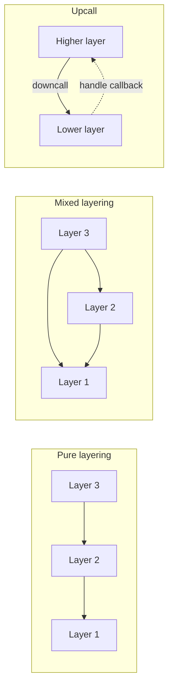
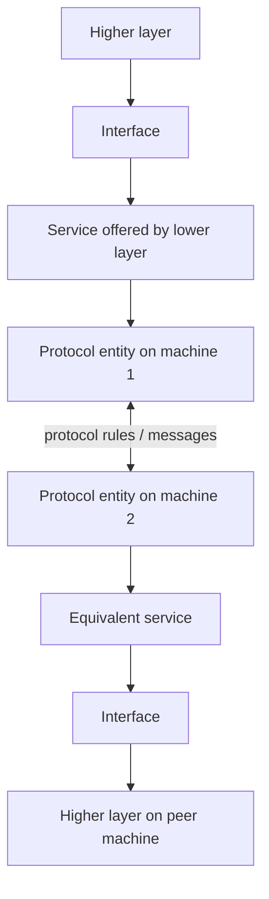
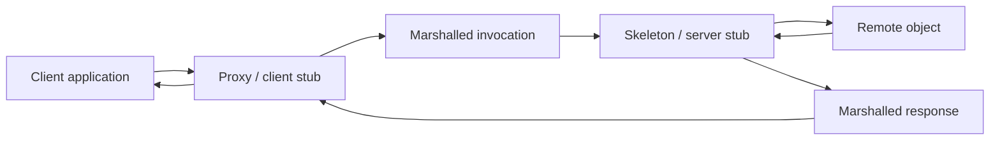
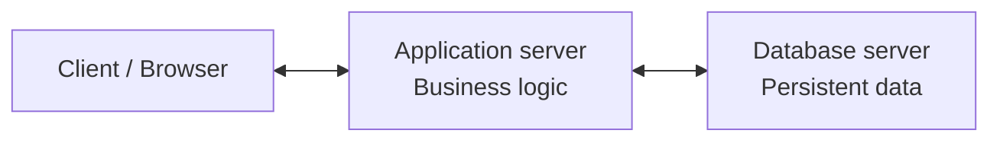
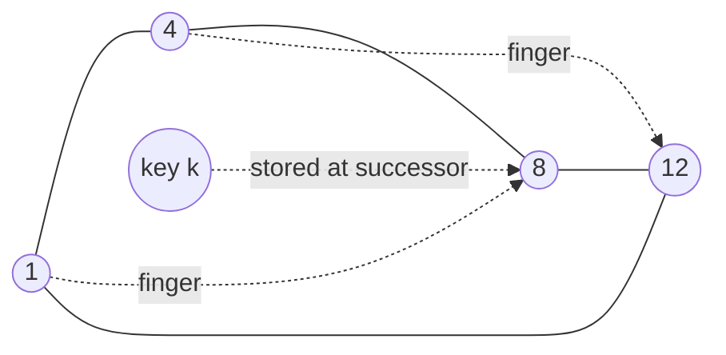
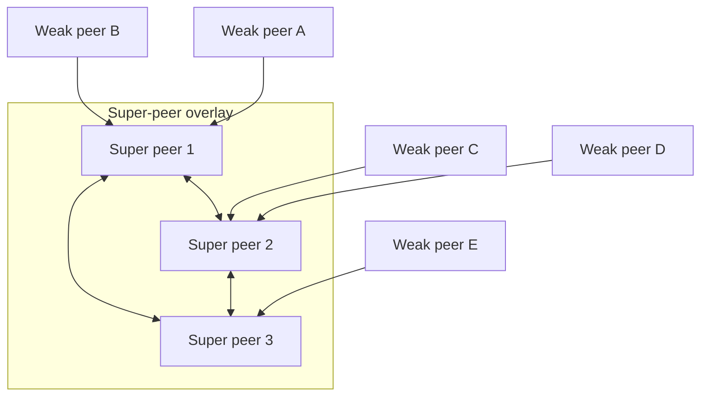
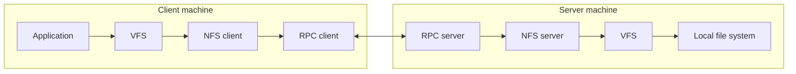

# Study Guide: Lec-2 | Distributed Systems Architectures

---

## 1. Architectures: Big Picture

Distributed systems are complex because software runs on multiple machines. Architecture is the organizing idea that helps you answer two different questions:

- **Logical question:** What components exist, and how do they interact?
- **Physical question:** Where do those components run, and how are they deployed?

### 1.1 Software Architecture vs System Architecture

| Term | Meaning |
|---|---|
| **Software Architecture** | The **logical organization** of software components and the way they interact, independent of hardware placement. |
| **System Architecture** | The **physical realization** of the system: which components are instantiated and where they are placed on actual machines. |
| **Components** | Modular units with clearly defined responsibilities and interfaces. |
| **Connectors** | Mechanisms used for communication and coordination between components. |
| **Logical Organization** | The **what** and **how** of interaction. |
| **Physical Realization** | The **where** of deployment. |

### 1.2 Middleware: Why It Matters

Middleware sits between the application and the operating system. Its job is to hide distribution details such as:

- location of components,
- communication protocols,
- machine heterogeneity,
- low-level distribution mechanics.

**Important exam point:** complete transparency is **not always desirable**. Real systems make trade-offs between transparency, performance, and fault awareness.

### 1.3 From Software Architecture to System Architecture

Logical components must eventually be mapped to physical machines. That mapping produces the **system architecture**.

Typical physical organizations from the lecture:

- **Centralized architectures**
- **Decentralized (peer-to-peer) architectures**
- **Hybrid architectures**

### 1.4 Common Exam Mistake

Do **not** confuse **layering** with **tiering**:

- **Layering** = logical software design.
- **Tiering** = physical deployment across machines.

Multiple logical layers can exist on a single physical machine.

### Memory Hook

- **L-P-M = Logic, Placement, Masking**
  - **Logic** → software architecture
  - **Placement** → system architecture
  - **Masking** → middleware hides distribution details

---

## 2. Software Architectural Styles

An **architectural style** describes:

- the kinds of components in a system,
- the connectors between them,
- the rules for composing them.

The lecture focuses on four major styles:

1. **Layered architectures**
2. **Object-based architectures**
3. **Resource-based architectures (REST)**
4. **Publish-subscribe architectures**

Real systems often combine multiple styles.

---

### 2.1 Layered Architectures

In a layered architecture, components are arranged in a hierarchy of layers.

- Higher layers use services of lower layers through **downcalls**.
- Direct upward calls are generally avoided.
- This improves modularity and separation of concerns.

#### Variants of Layering

| Variant | Core Idea | Common Use |
|---|---|---|
| **Pure layering** | Each layer communicates only with the layer directly below it. | Protocol stacks such as TCP/IP |
| **Mixed layering** | A layer may access multiple lower layers directly. | Operating systems and libraries |
| **Upcalls** | A lower layer invokes a handler/callback in a higher layer. | Event notification, interrupts |

**Exam detail:** in an **upcall**, the lower layer triggers a specific registered handler in the higher layer.

#### Service, Interface, and Protocol

Each layer is described using three related concepts:

| Concept | Meaning |
|---|---|
| **Service** | What the layer provides to higher layers |
| **Interface** | How the service is accessed |
| **Protocol** | How peer layers implement that service through communication |

The interface hides implementation details; the protocol defines the communication rules.

#### Example: Reliable Connection-Oriented Communication

This service guarantees:

- reliable delivery,
- message ordering,
- connection setup before data transfer.

On the Internet, this is typically provided by **TCP**.

Typical server-side socket operations:

- `socket()`
- `accept()`
- `send()` / `recv()`
- `close()`

#### Application Layering

Many distributed applications use three logical layers:

| Layer | Responsibility |
|---|---|
| **Interface layer** | User interaction or API interaction |
| **Processing layer** | Core application logic |
| **Data layer** | Persistent storage and data management |

**Lecture example:** Internet search engine

- **Interface layer** accepts user queries and shows results.
- **Processing layer** translates queries and ranks results.
- **Data layer** stores indexed pages.

---

### 2.2 Object-Based Architectures

Object-based architectures organize a system as a collection of loosely coupled objects.

#### Key ideas

- An object represents a software component with a clear responsibility.
- Objects interact using **procedure calls**.
- In distributed systems, those calls may cross machine boundaries.

#### Encapsulation

Each object encapsulates:

- **State** → internal data
- **Methods** → operations on that data

Objects expose functionality through interfaces while hiding internal implementation.

#### Distributed Objects

In a distributed object system:

- object state resides on one machine,
- the client uses a **proxy**,
- the server handles requests through a **stub/skeleton**,
- distribution details are hidden from the client.

#### From Objects to Services

Object-based design naturally evolves into **Service-Oriented Architecture (SOA)**.

In SOA:

- systems are composed of independent services,
- services may belong to different organizations,
- each service exposes a well-defined interface.

**Lecture example:** a web shop using an external payment service.

---

### 2.3 Resource-Based Architectures (REST)

REST views a distributed system as a collection of **resources** that are managed uniformly.

#### Why REST matters

As service composition became common on the Web, tightly coupled service interfaces became difficult to manage. REST simplifies interaction by using resources and a uniform interface.

#### Four Core REST Properties

| Property | Meaning |
|---|---|
| **Uniform Resource Identification** | Each resource has a unique identifier such as a URI. |
| **Uniform Interface** | A small fixed set of operations is used for all resources. |
| **Self-descriptive Messages** | Requests/responses contain all information needed for processing. |
| **Stateless Execution** | The server stores no client context between requests. |

#### Actual Mnemonic for REST

- **U-U-S-S = “Unicorns Use Smart Scooters.”**
  - **Uniform** resource identification
  - **Uniform** interface
  - **Self-descriptive** messages
  - **Stateless** execution

#### Standard REST Operations

| Operation | Purpose |
|---|---|
| **PUT** | Create a resource |
| **GET** | Retrieve a resource |
| **POST** | Modify/process a resource |
| **DELETE** | Remove a resource |

**Lecture example:** Amazon S3 uses REST-style access to buckets and objects.

#### REST vs SOAP / Service-Specific Interfaces

| Aspect | REST / Generic Interface | SOAP / Service-Specific Interface |
|---|---|---|
| Operations | Few generic operations | Many service-specific operations |
| Where meaning is expressed | In parameters/strings | In explicit operation names |
| Error detection | More runtime-oriented | Often earlier and clearer |
| Flexibility | High | Lower |
| Clarity of intent | Lower | Higher |

**Important lecture note:** much of the REST vs SOAP discussion is really about **interface design and access transparency**, not raw functionality.

---

### 2.4 Publish-Subscribe Architectures

Publish-subscribe architectures aim for **loose coupling** by separating processing from coordination.

Two important dimensions are used to compare coordination styles:

- **Temporal coupling** → do sender and receiver need to be active at the same time?
- **Referential coupling** → do processes need to explicitly know each other?

#### Coordination Forms

| Coordination Form | Temporally Coupled? | Referentially Coupled? |
|---|---:|---:|
| **Direct** | Yes | Yes |
| **Mailbox** | No | Yes |
| **Event-based** | Yes | No |
| **Shared data space** | No | No |

#### Interpretation

- **Event-based coordination**: publishers and subscribers need not know each other, but both must be active around publication time.
- **Shared data space**: strongest decoupling; processes need not know each other and need not be active at the same time.

#### Subscription Types

- **Topic-based subscriptions** → based on attributes/labels
- **Content-based subscriptions** → based on values, ranges, or predicates

#### Delivery Models

Two common choices:

1. send the data item directly with the notification,
2. send a notification first and let receivers fetch the data separately.

#### Main Challenges

- scalable event matching,
- efficient delivery,
- event composition from distributed sources.

---

## 3. Middleware Organization and Adaptation

The lecture distinguishes **architectural styles** from the **internal organization of middleware**.

Middleware should be as **open** as possible so it can evolve without shutting down the entire system.

### 3.1 Wrappers

A **wrapper** (adapter) solves interface incompatibility.

#### Core idea

- Legacy or external components expose native interfaces.
- Those interfaces may be unsuitable or incompatible.
- A wrapper presents a cleaner interface to the client and translates calls to the underlying component.

#### In distributed systems

Wrappers can also hide distribution and implementation details.

**Lecture example:** a Web server can act as a wrapper in front of Amazon S3 internals.

#### Scalability warning

If every application builds wrappers for every other application:

- number of wrappers becomes $N(N-1)$,
- complexity becomes $O(N^2)$.

To reduce this, use a **broker** instead of pairwise wrappers everywhere.

### 3.2 Interceptors

An **interceptor** is a hook in the middleware execution path.

It allows extra code to execute **before or after** a normal operation, without changing the application itself.

#### In remote object invocation

Invocation typically proceeds as:

1. object `A` calls a local interface for object `B`,
2. the call is converted into a generic invocation,
3. the invocation is turned into a network message.

Interceptors may act at two levels:

| Interceptor Type | Use |
|---|---|
| **Request-level interceptor** | Modify, replicate, or redirect invocations; support transparent object replication or failure handling |
| **Message-level interceptor** | Fragment data, optimize transport, improve reliability/performance |

### 3.3 Modifiable Middleware

Dynamic environments introduce changing conditions such as:

- mobility,
- varying network quality,
- device constraints,
- failures.

The lecture pushes this responsibility into middleware rather than application code.

#### How modification is achieved

- interceptor-based runtime adaptation,
- component replacement during execution,
- static or dynamic composition of middleware components.

#### Requirements

- safe loading/unloading of components,
- clearly defined interfaces,
- careful treatment of stateful components.

### Memory Hook

- **W-I-M = “Wizards Inspect Machines.”**
  - **Wrappers**
  - **Interceptors**
  - **Modifiable middleware**

---

## 4. System Architecture: Physical Organizations

System architecture is about actual deployment:

- which components are used,
- how they interact,
- where they run.

The lecture divides system architectures into three families:

1. **Centralized**
2. **Decentralized**
3. **Hybrid**

---

### 4.1 Centralized Organizations

The dominant centralized model is **client-server**.

#### Basic client-server model

- **Client** requests a service.
- **Server** provides the service.
- Interaction follows **request-reply**.

#### Communication choices

| Style | Notes |
|---|---|
| **Connectionless** | Efficient in reliable local networks, but message loss may cause duplicate execution; safe mainly for **idempotent** operations. |
| **Connection-oriented** | More reliable; commonly used on the Internet; has connection setup overhead. |

**Important exam point:** roles are not absolute. A server may act as a client to another server.

#### Two-Tier Architecture

Logical layers are often:

- user interface,
- processing,
- data.

In a simple **two-tier** deployment:

- client machine handles the interface,
- server machine handles processing and/or data management.

Common two-tier variants from the lecture:

- terminal-like client,
- full UI on client with processing on server,
- partial application logic on client,
- client-side caching.

#### Three-Tier Architecture

Typical physical split:

1. **Client**
2. **Application server**
3. **Data server**

Examples:

- transaction processing systems,
- Web server → application server → database server.

**Thin clients** are easier to manage; **fat clients** remain useful for rich interactive applications.

---

### 4.2 Decentralized Organizations: Peer-to-Peer Systems

Multitier client-server systems mainly use **vertical distribution**:

- logically different components are placed on different machines.

P2P systems instead use **horizontal distribution**:

- logically similar parts share the workload across many nodes.

#### Core characteristics of P2P

- all processes are roughly equal,
- each process may act as both client and server,
- nodes form an **overlay network**.

Overlay networks are either **structured** or **unstructured**.

#### Structured P2P

Structured P2P uses deterministic overlay topologies such as:

- ring,
- tree,
- grid,
- hypercube.

These support efficient lookup by organizing data placement and routing.

#### Distributed Hash Tables (DHTs)

A DHT maps data items to keys:

$$
key = hash(data\ item)
$$

The system stores `(key, value)` pairs, and each node is responsible for a subset of keys.

Fundamental operation:

$$
node = lookup(key)
$$

#### Hypercube Example

In a hypercube-based P2P system:

- nodes have binary identifiers,
- data keys match the identifier space,
- each routing hop moves closer to the destination key.

#### Chord System

Chord organizes nodes in a logical ring.

- Keys and node identifiers share one identifier space.
- A key `k` is stored at the first node with identifier at least `k`.
- Each node maintains shortcuts in a **finger table**.
- Lookup takes **$O(\log N)$ hops**.

#### Unstructured P2P

Unstructured P2P systems:

- do not maintain a fixed topology,
- use ad hoc neighbor lists,
- behave like dynamic random graphs.

##### Search by Flooding

- request is forwarded to all neighbors,
- duplicates are ignored,
- limited using **TTL**.

Trade-off:

- fast discovery,
- high traffic cost.

##### Search by Random Walk

- request is forwarded to one random neighbor at a time,
- generates much lower traffic,
- may take longer to find the item.

#### Hierarchical P2P / Super Peers

To improve scalability, some nodes become **super peers**.

- weak peers connect to a super peer,
- super peers maintain indexes or user/resource information,
- super peers may themselves form a P2P network.

**Lecture example:** Skype used super peers for lookup and NAT traversal, while still retaining limited central control through a login server.

### Memory Hook

- **R-T-G-H = “Royal Tigers Guard Hills.”**
  - **Ring**
  - **Tree**
  - **Grid**
  - **Hypercube**

---

### 4.3 Hybrid Architectures

Hybrid architectures combine centralized and decentralized ideas.

They aim to balance:

- scalability,
- performance,
- manageability.

#### Edge-Server Systems

Edge servers are placed near the boundary of the Internet, often by ISPs.

Main functions:

- serve content closer to users,
- perform filtering/transcoding,
- reduce latency and network load.

Modern evolution:

- cloud data centers handle core computation,
- edge servers assist with storage and processing,
- this leads toward **distributed cloud** and **fog computing**.

#### Collaborative Distributed Systems

These systems often start with centralized coordination and then shift to decentralized operation.

##### BitTorrent from the lecture

- file is divided into chunks,
- peers download from multiple peers,
- a tracker helps new peers get started,
- collaboration is enforced by upload/download incentives,
- newer designs also use DHTs to reduce dependence on centralized trackers.

**High-value phrase for exams:** centralized bootstrapping, decentralized data exchange.

---

## 5. Example Architectures

### 5.1 Network File System (NFS)

NFS is a distributed file system originally associated with Sun Microsystems and widely used in Unix/Linux environments.

#### Main goal

Provide a standardized and transparent view of remote file systems while hiding local file-system differences.

#### File Access Models

| Model | Idea |
|---|---|
| **Remote access model** | Files remain on the server; clients perform operations remotely. |
| **Upload/download model** | Client downloads the file, edits locally, then uploads it back. Example: FTP. |

NFS follows the **remote access model**.

#### Layered NFS Architecture

- application issues normal file-system calls,
- **VFS (Virtual File System)** handles them,
- VFS forwards operations either to the local file system or to the NFS client for remote files.

#### Role of RPC

All NFS communication uses **Remote Procedure Calls (RPC)**:

- client converts file operations into RPC requests,
- server RPC layer translates them into VFS operations,
- VFS accesses the local file system.

#### NFSv3 vs NFSv4

| Feature | **NFSv3** | **NFSv4** |
|---|---|---|
| **Server state** | Stateless | Stateful |
| **Access style** | Operation-oriented | POSIX-oriented |
| **Open/close support** | No explicit open/close style semantics | Explicit open/close support |
| **Locks / sessions** | Limited | Supported |
| **Namespace** | Local mounts | Global namespace vision |
| **Traversal** | Manual | Automatic across mount points |
| **Main strength** | Simplicity, recovery, scalability | Richer correctness and usability |

---

### 5.2 The Web

The Web is a large-scale distributed system with architecture similar to classic client-server systems.

#### Evolution

Early Web:

- static, passive documents.

Modern Web:

- dynamically generated pages,
- interactive applications,
- service-oriented behavior, not just document retrieval.

#### Core Web Components

- **Browser** → client
- **Web server** → server

#### URLs and Access

A URL identifies:

- the server’s DNS name,
- the resource/document location,
- the application protocol such as HTTP.

Browser-server communication uses the **HTTP request-response model**.

#### Web Documents

| Type | Notes |
|---|---|
| **Plain text** | Transferred and displayed directly |
| **HTML documents** | Contain markup interpreted by the browser |
| **Embedded scripts** | Usually JavaScript; enable client-side interaction and computation |

---

### 5.3 Multitiered Web Architectures

Early Web systems were largely **two-tier**:

- browser
- Web server

Modern Web systems are **multitiered** and build pages dynamically using scripts, databases, and application logic.

#### CGI-Based Processing Flow

Classic CGI flow from the lecture:

1. Browser sends HTTP request.
2. Web server receives the request.
3. Server invokes a CGI program.
4. CGI program processes input, often with database access.
5. Generated HTML is returned to the browser.

#### Server-Side Scripts

Modern servers often execute server-side scripts such as:

- PHP,
- server-side Java,
- Python.

These support:

- personalization,
- database-backed pages,
- fully dynamic Web applications.

---

## 6. Exam Master Reference

### 6.1 Frequently Asked Differentiators

| Comparison | Correct Distinction |
|---|---|
| **Software vs System Architecture** | Logical organization vs physical deployment |
| **Layering vs Tiering** | Logical design vs physical placement |
| **Structured vs Unstructured P2P** | Deterministic routing/topology vs ad hoc topology/search |
| **REST vs SOAP** | Few generic operations vs many service-specific operations |
| **NFSv3 vs NFSv4** | Stateless simplicity vs stateful richer semantics |

### 6.2 Diagram Practice Checklist

Make sure you can draw and label:

1. **Pure, mixed, and upcall layering**
2. **Service / interface / protocol** in a layered stack
3. **Proxy–skeleton distributed object model**
4. **Three-tier client → app server → data server**
5. **Chord ring with finger table**
6. **Super-peer hierarchy**
7. **NFS layered organization with VFS and RPC**
8. **CGI request-processing flow**

### 6.3 Mermaid Diagram Bank

Use these directly in Markdown preview that supports Mermaid.

#### Diagram 1: Layered Architectures — Pure, Mixed, and Upcall

#### Diagram 2: Service, Interface, and Protocol in a Layered Stack

#### Diagram 3: Proxy–Skeleton Distributed Object Model

#### Diagram 4: Three-Tier Architecture

#### Diagram 5: Chord Ring with Finger-Table Shortcut Idea

#### Diagram 6: Super-Peer Hierarchy

#### Diagram 7: NFS Layered Organization with VFS and RPC

#### Diagram 8: CGI Request-Processing Flow

### 6.4 Fast Revision Summary

- **Software architecture** = logical organization.
- **System architecture** = physical deployment.
- **Middleware** hides distribution details but total transparency is not always best.
- **Layered, object-based, REST, and publish-subscribe** are the main software styles.
- **Client-server, P2P, and hybrid** are the main system organizations.
- **NFS** shows remote file access through VFS and RPC.
- **The Web** evolved from static two-tier document delivery to dynamic multitier systems.

### 6.5 Final Memory Hooks

- **L-P-M = Logic, Placement, Masking**
- **U-U-S-S = Unicorns Use Smart Scooters**
- **R-T-G-H = Royal Tigers Guard Hills**
- **W-I-M = Wizards Inspect Machines**

---

## 7. Last-Minute Viva / Theory Triggers

If asked for one-line answers:

- **Architecture in distributed systems**: the organized design of software components and their deployment across machines.
- **Middleware**: the software layer that hides distribution details from applications.
- **REST**: resource-based architecture with uniform identification, uniform interface, self-descriptive messages, and stateless execution.
- **Chord**: structured P2P ring with finger-table shortcuts and $O(\log N)$ lookup.
- **Super peer**: a stronger node that indexes or coordinates weaker peers in hierarchical P2P.
- **BitTorrent**: a hybrid collaborative system with centralized bootstrapping and decentralized chunk exchange.
