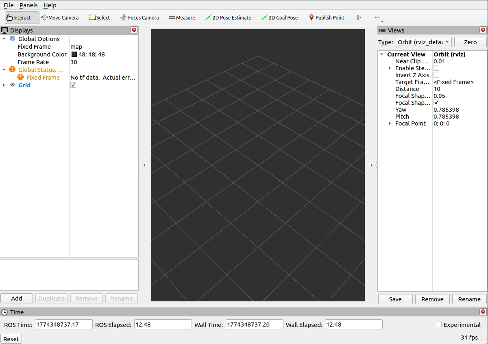
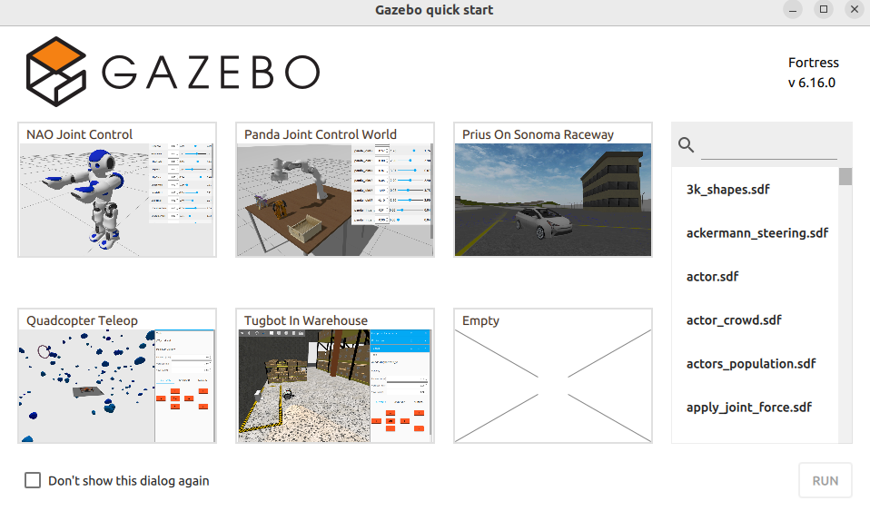
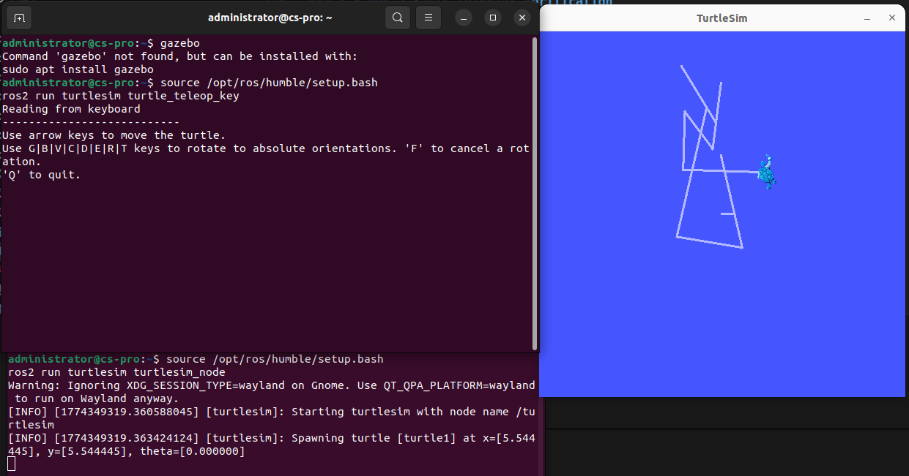

# LAB 6

## Introduction to Robot Operating System (ROS)


## Student Details

* Name: Naishadh Rana 
* Roll No.: U23CS014

---

## 1. Aim

To install and verify ROS 2 Humble, MoveIt, RViz, PlanSys2, and Gazebo, then run the Panda arm pick-and-place demonstration using MoveIt Task Constructor and PlanSys2.

---

## 2. Software/Environment Used

* Operating System: Ubuntu 22.04 / WSL2 / Mac (as applicable)
* ROS 2 Humble
* MoveIt 2
* RViz2
* PlanSys2
* Gazebo / Ignition Fortress
* Panda robot simulation/demo packages

---

## 3. Part A: Environment and Software Installations

### 3.1 ROS 2 Humble Installation Verification

**Command used:**

```bash
source /opt/ros/humble/setup.bash
ros2 --help
ros2 pkg list
```

**Result/Output:**
```
administrator@cs-pro:~/Desktop/Folders/U23CS014$ ros2 --help
usage: ros2 [-h] [--use-python-default-buffering] Call `ros2 <command> -h` for more detailed usage. ...

ros2 is an extensible command-line tool for ROS 2.

options:
  -h, --help            show this help message and exit
  --use-python-default-buffering
                        Do not force line buffering in stdout and instead use the python default buffering, which might be affected by PYTHONUNBUFFERED/-u and depends on whatever
                        stdout is interactive or not
```

**Observation/Comment:**
ROS 2 Humble was installed and configured correctly, and the terminal recognized ROS 2 commands after sourcing the setup file.

---

### 3.2 RViz2 Verification

**Command used:**

```bash
source /opt/ros/humble/setup.bash
ros2 run rviz2 rviz2
```

**Result/Output:**



**Observation/Comment:**
RViz2 started properly and can be used for robot visualization, planning, and scene inspection.

---

### 3.3 PlanSys2 Installation Verification

**Command used:**

```bash
sudo apt install ros-humble-plansys2-*
```

**Result/Output:**

* PlanSys2 packages were installed successfully.
* Required dependencies were resolved.

[Output too long to be shown]

---

### 3.4 Gazebo / Ignition Fortress Installation Verification

**Commands used:**

```bash
sudo apt-get update
sudo apt-get install lsb-release gnupg
sudo curl https://packages.osrfoundation.org/gazebo.gpg --output /usr/share/keyrings/pkgs-osrf-archive-keyring.gp

echo "deb [arch=$(dpkg --print-architecture) signed-by=/usr/share/keyrings/pkgs-osrf-archive-keyring.gpg] https://packages.osrfoundation.org/gazebo/ubuntu-stable $(lsb_release -cs) main" | sudo tee /etc/apt/sources.list.d/gazebo-stable.list > /dev/null
sudo apt-get update
sudo apt-get install ignition-fortress
```

**Result/Output:**

* Gazebo repository was added.
* Ignition Fortress installation completed successfully.



**Observation/Comment:**
Gazebo/Ignition Fortress was installed and can be used for simulation and robot testing.

---

### 3.5 ROS 2 Basic Tutorial Verification

**Commands used:**

```bash
cd ~/ros2_ws/src
ros2 pkg create --build-type ament_cmake <package_name>
ros2 pkg list
ros2 pkg executables turtlesim
ros2 run turtlesim turtlesim_node #T1
ros2 run turtlesim turtle_teleop_key #T2
```

**Result/Output:**



---

## 4. Part A: MoveIt Installation and Verification

### 4.1 MoveIt Task Constructor Repository Setup

**Commands used:**

```bash
cd ~/ws_moveit/src
git clone -b humble https://github.com/moveit/moveit_task_constructor.git
cd ~/ws_moveit
```

## 5. Part B:  Panda Arm Demo

```bash
# Terminal 1:
source install/setup.bash
ros2 launch moveit2_tutorials mtc_demo.launch.py # Loads the robot

# Terminal 2
source install/setup.bash
ros2 launch moveit2_tutorials pick_place_demo.launch.py # Pick and Place operation
```

**Result/Output:**


---

## 5. Part B: Panda Arm Pick-and-Place

### Source Code Setup

**Source used:**

* PANDA_PICK_PLACE / AVCAR_PANDA_PICK_PLACE project files

**Commands used:**

```bash
colcon build
source install/setup.bash
```

### 5.1 Launching the Panda Pick-and-Place Demo

**Commands used:**
Terminal 1:

```bash
ros2 launch plansys2_bt_example plansys2_bt_example_launch.py
```

Terminal 2:

```bash
ros2 launch panda_ros2_moveit2 panda_interface.launch.py
```

Terminal 3:

```bash
ros2 run ros2_clients actor
```

Terminal 4:

```bash
ros2 run plansys2_bt_example server
```

**Result/Output:**

* The demo components launched successfully.
* The Panda interface, PlanSys2 server, and supporting node(s) started.
* Plan and execution behavior was visible in the interface/logs.


**Observation/Comment:**
- The pick-and-place system launched correctly. The arm was able to follow the planning sequence when a valid plan was generated.
- The pick-and-place workflow followed the expected sequence of pre-grasp, approach, grasp, lift, transfer, place, and retreat.
