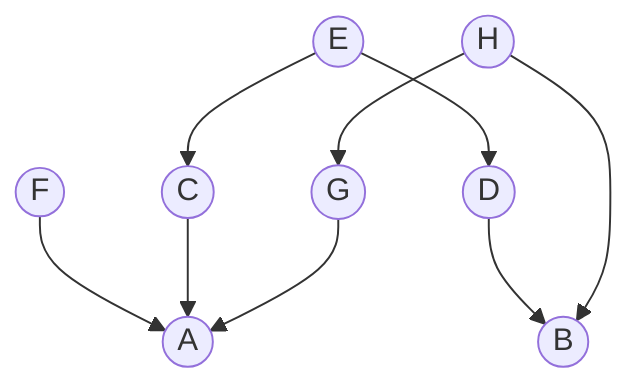

# Assignment 9 | Implementation of SimRank Algorithm

**Date:** 03-Mar-2026

## Problem Statement
Create a toy citation network as follows:

Use this network to perform SimRank-based similarity analysis.

You need to:
- Implement the SimRank algorithm (as per the basic SimRank equation, Section 4.2 of the attached paper).
- Find out the similarity between each pair of nodes in the network.
- Submit your program with necessary explanation.
