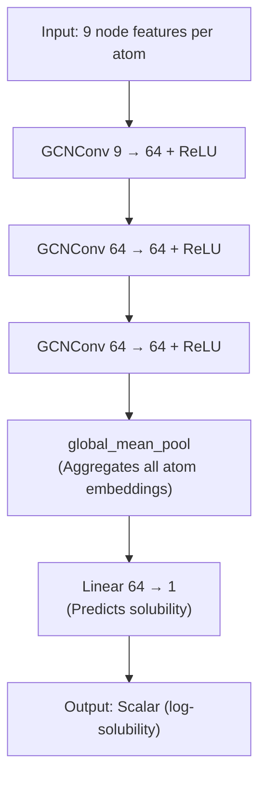
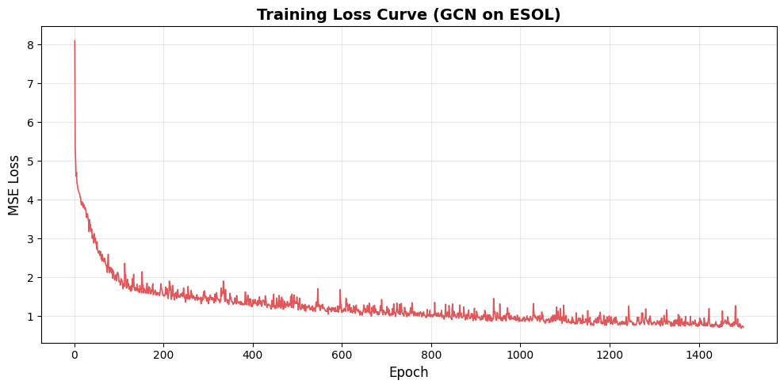
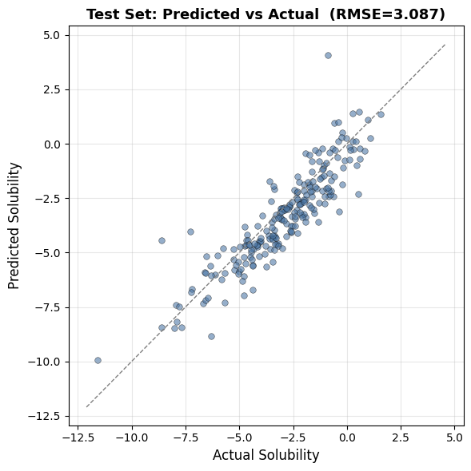

# Lab 12 – Graph Neural Networks
**Name:** Naishadh Rana     
**Roll No.:** U23CS014  
**Course:** CS342 – Social Network Analysis  

---

## Problem Statement

Lab objective:
1. Load the **ESOL (Delaney) dataset** — a benchmark collection of ~1,128 small organic molecules with experimentally measured water-solubility values.
2. Build and train a **Graph Convolutional Network (GCN)** using **PyTorch Geometric**.
3. Evaluate the model's ability to predict the log-solubility (log mol/L) of molecules it has never seen during training.

Molecules can naturally be represented as graphs where atoms are nodes and chemical bonds are edges. GNNs are useful here because they can work directly on this graph structure instead of needing hand-crafted features like traditional ML methods.

I used **PyTorch Geometric** to build the GCN model and **RDKit** to handle molecule data.

---

## Dataset

The ESOL dataset is loaded using the `MoleculeNet` class from PyTorch Geometric. It contains molecular graphs where:

- **Nodes (atoms)** have 9 features each (like atomic number, degree, hybridisation, etc.)
- **Edges (bonds)** connect atoms based on chemical bonds
- **Label (y)** is the log water-solubility value for each molecule

The dataset is split into train (80%), validation (10%), and test (10%) sets.

---

## Model – Graph Convolutional Network (GCN)

The model has 3 graph convolutional layers followed by a linear layer for regression.

- `GCNConv` layers learn features by aggregating information from neighbouring atoms
- `global_mean_pool` is used because molecules have different numbers of atoms, so we need to get one fixed-size vector for the whole graph
- The final linear layer gives the predicted solubility value

---

## Training

| Hyperparameter | Value |
|---|---|
| Optimiser | Adam |
| Learning rate | 0.0007 |
| Loss function | Mean Squared Error (MSE) |
| Epochs | 1500 |
| Batch size | 64 |

One issue I ran into was a shape mismatch — the model output was `[64]` but the target was `[64, 1]`. This caused wrong broadcasting in the MSE loss. The fix was to add `.squeeze()` on both sides so they become the same shape before computing loss.

### Training Loss (per 100 epochs)

| Epoch | Train MSE |
|---|---|
| 1 | 8.1021 |
| 100 | 1.8906 |
| 200 | 1.5279 |
| ... | ... |
| 1400 | 0.8377 |
| 1500 | 0.7152 |

---

## Training Loss Curve

The curve shows the model learns fast in the first few hundred epochs and then slowly improves after that.

---

## Results on Test Set

| Metric | Value |
|---|---|
| Test MSE | 9.5279 |
| Test RMSE | 3.0867 |
| Test MAE | 2.4526 |

The training loss is much lower than test loss which shows there is some overfitting. This is expected since the dataset is small (about 1,100 molecules). The model still learns a reasonable trend as seen in the scatter plot of predicted vs actual values.

---

## Conclusion

In this lab I implemented a GCN to predict molecular solubility. I learned how molecules can be represented as graphs and how GNNs can operate on them directly. The model was trained for 1500 epochs and showed a steady decrease in loss. The test results show the model generalises reasonably but overfits a bit due to the small dataset size.

