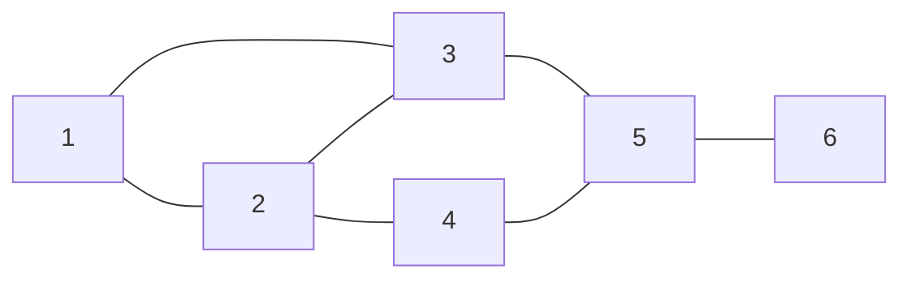
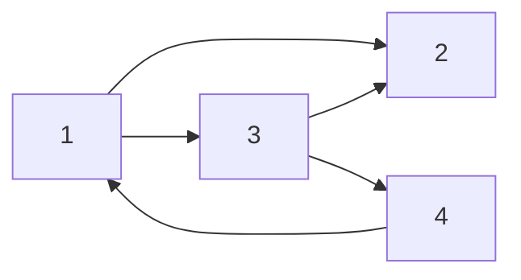
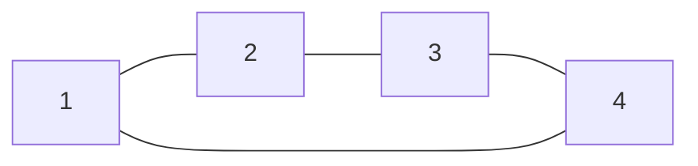
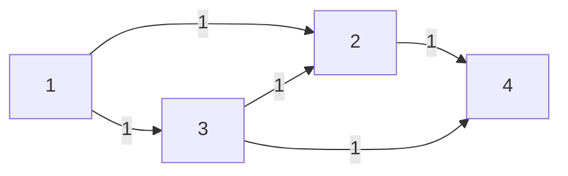

# SNA - March 2025 Mid Semester Examination
**SVNIT, Surat**  

## Expected Solutions

---

### Q.1 (a) [5 Marks]

For the below graph, calculate **degree centrality**, **betweenness centrality**, and **clustering coefficient** for **node 3**.

**Expected Solution:**

For node $3$, the neighborhood is
$\Gamma(3)=\{1,2,5\}$, so $\deg(3)=3$.

1. **Degree centrality**

$$
C_D(3)=\frac{\deg(3)}{n-1}=\frac{3}{6-1}=\frac{3}{5}=0.6
$$

2. **Betweenness centrality**

Betweenness is

$$
C_B(3)=\sum_{s<t,\; s,t\neq 3}\frac{\sigma_{st}(3)}{\sigma_{st}}
$$

where $\sigma_{st}$ is the number of shortest paths from $s$ to $t$, and $\sigma_{st}(3)$ is the number of those shortest paths passing through node $3$.

Consider all unordered pairs among $\{1,2,4,5,6\}$:

| Pair $(s,t)$ | Shortest path(s) | Contribution of node 3 |
| --- | --- | --- |
| $(1,2)$ | $1-2$ | $0$ |
| $(1,4)$ | $1-2-4$ | $0$ |
| $(1,5)$ | $1-3-5$ | $1$ |
| $(1,6)$ | $1-3-5-6$ | $1$ |
| $(2,4)$ | $2-4$ | $0$ |
| $(2,5)$ | $2-3-5$, $2-4-5$ | $\frac{1}{2}$ |
| $(2,6)$ | $2-3-5-6$, $2-4-5-6$ | $\frac{1}{2}$ |
| $(4,5)$ | $4-5$ | $0$ |
| $(4,6)$ | $4-5-6$ | $0$ |
| $(5,6)$ | $5-6$ | $0$ |

Hence the unnormalized betweenness is

$$
1+1+\frac{1}{2}+\frac{1}{2}=3
$$

For an undirected graph with $n=6$, the normalized value is

$$
C_B^{\text{norm}}(3)=\frac{3}{\binom{5}{2}}=\frac{3}{10}=0.3
$$

3. **Clustering coefficient**

Node $3$ has neighbors $\{1,2,5\}$. Among these neighbors, only one edge exists: $(1,2)$.

The maximum possible number of edges among 3 neighbors is

$$
\binom{3}{2}=3
$$

Therefore,

$$
C(3)=\frac{1}{3}\approx 0.333
$$

**Final answer for node 3:**

- Degree centrality $=0.6$
- Betweenness centrality $=3$ unnormalized, or $0.3$ normalized
- Clustering coefficient $=\frac{1}{3}$

---

### Q.1 (b) [8 Marks]

1. Compute **Hub** and **Authority** score for the below graph using **Hypertext Induced Topic Search (HITS)** algorithm. Take **initial hub and authority scores as 1 for each node**. Show computation for **two iterations**.

2. Consider a **citation network** that describes citations between research papers. Discuss how **HITS algorithm** will be useful for:
- **Co-citation analysis:** If papers *i* and *j* are both cited by paper *k*, then they may be related in some sense to one another.
- **Bibliographic coupling analysis:** If papers *i* and *j* both cite paper *k*, then they may be related.

**Expected Solution:**

For HITS,

$$
a_i=\sum_{j\to i} h_j,
\qquad
h_i=\sum_{i\to j} a_j
$$

Take initial hub scores as

$$
h^{(0)}=(1,1,1,1)
$$

for nodes $(1,2,3,4)$.

#### 1. Two iterations of HITS

The directed edges are:

- $1 \to 2$
- $1 \to 3$
- $3 \to 2$
- $3 \to 4$
- $4 \to 1$

##### Iteration 1: authority update

Using incoming links,

$$
\begin{aligned}
a_1^{(1)} &= h_4^{(0)} = 1 \\
a_2^{(1)} &= h_1^{(0)} + h_3^{(0)} = 2 \\
a_3^{(1)} &= h_1^{(0)} = 1 \\
a_4^{(1)} &= h_3^{(0)} = 1
\end{aligned}
$$

So the raw authority vector is

$$
a^{(1)}_{raw}=(1,2,1,1)
$$

Normalize by Euclidean norm:

$$
\|a^{(1)}_{raw}\|=\sqrt{1^2+2^2+1^2+1^2}=\sqrt{7}
$$

Therefore,

$$
a^{(1)}=\left(\frac{1}{\sqrt{7}},\frac{2}{\sqrt{7}},\frac{1}{\sqrt{7}},\frac{1}{\sqrt{7}}\right)
\approx (0.378,0.756,0.378,0.378)
$$

##### Iteration 1: hub update

Using outgoing links,

$$
\begin{aligned}
h_1^{(1)} &= a_2^{(1)} + a_3^{(1)} = \frac{3}{\sqrt{7}} \\
h_2^{(1)} &= 0 \\
h_3^{(1)} &= a_2^{(1)} + a_4^{(1)} = \frac{3}{\sqrt{7}} \\
h_4^{(1)} &= a_1^{(1)} = \frac{1}{\sqrt{7}}
\end{aligned}
$$

So the raw hub vector is

$$
h^{(1)}_{raw}=\left(\frac{3}{\sqrt{7}},0,\frac{3}{\sqrt{7}},\frac{1}{\sqrt{7}}\right)
$$

Normalize:

$$
\|h^{(1)}_{raw}\|=\sqrt{\frac{9+9+1}{7}}=\sqrt{\frac{19}{7}}
$$

Hence,

$$
h^{(1)}=\left(\frac{3}{\sqrt{19}},0,\frac{3}{\sqrt{19}},\frac{1}{\sqrt{19}}\right)
\approx (0.688,0,0.688,0.229)
$$

##### Iteration 2: authority update

Using $h^{(1)}$,

$$
\begin{aligned}
a_1^{(2)} &= h_4^{(1)} = \frac{1}{\sqrt{19}} \\
a_2^{(2)} &= h_1^{(1)} + h_3^{(1)} = \frac{6}{\sqrt{19}} \\
a_3^{(2)} &= h_1^{(1)} = \frac{3}{\sqrt{19}} \\
a_4^{(2)} &= h_3^{(1)} = \frac{3}{\sqrt{19}}
\end{aligned}
$$

So,

$$
a^{(2)}_{raw}=\left(\frac{1}{\sqrt{19}},\frac{6}{\sqrt{19}},\frac{3}{\sqrt{19}},\frac{3}{\sqrt{19}}\right)
$$

Normalize:

$$
\|a^{(2)}_{raw}\|=\sqrt{\frac{1+36+9+9}{19}}=\sqrt{\frac{55}{19}}
$$

Therefore,

$$
a^{(2)}=\left(\frac{1}{\sqrt{55}},\frac{6}{\sqrt{55}},\frac{3}{\sqrt{55}},\frac{3}{\sqrt{55}}\right)
\approx (0.135,0.809,0.405,0.405)
$$

##### Iteration 2: hub update

Using $a^{(2)}$,

$$
\begin{aligned}
h_1^{(2)} &= a_2^{(2)} + a_3^{(2)} = \frac{9}{\sqrt{55}} \\
h_2^{(2)} &= 0 \\
h_3^{(2)} &= a_2^{(2)} + a_4^{(2)} = \frac{9}{\sqrt{55}} \\
h_4^{(2)} &= a_1^{(2)} = \frac{1}{\sqrt{55}}
\end{aligned}
$$

Normalize:

$$
\|h^{(2)}_{raw}\|=\sqrt{\frac{81+81+1}{55}}=\sqrt{\frac{163}{55}}
$$

Thus,

$$
h^{(2)}=\left(\frac{9}{\sqrt{163}},0,\frac{9}{\sqrt{163}},\frac{1}{\sqrt{163}}\right)
\approx (0.705,0,0.705,0.078)
$$

##### Interpretation after two iterations

- **Best authority:** node $2$, because it is pointed to by strong hub nodes $1$ and $3$.
- **Best hubs:** nodes $1$ and $3$, because both point to important authorities.
- Node $4$ has small hub score and moderate authority score.

#### 2. Use of HITS in citation networks

In a citation network, a directed edge usually means “paper $i$ cites paper $j$”.

1. **For co-citation analysis**

If papers $i$ and $j$ are both cited by the same paper $k$, they are likely to belong to a similar topic area. HITS helps here because papers with large **authority scores** are papers that are cited by good hub papers. Thus, when many strong hub papers cite the same set of papers, those cited papers emerge as related and authoritative. This is exactly the intuition behind co-citation.

2. **For bibliographic coupling analysis**

If papers $i$ and $j$ both cite paper $k$, then $i$ and $j$ may be similar because they rely on related references. In HITS terms, papers that point to many important authorities obtain higher **hub scores**. Therefore, papers with similar outgoing citation patterns tend to behave as similar hubs, which supports bibliographic coupling analysis.

**Conclusion:** In citation networks, HITS distinguishes between:

- **Authorities:** highly cited, influential papers
- **Hubs:** survey, review, or connecting papers that cite many useful authorities

This makes HITS useful for discovering both influential papers and topic relationships between papers.

---

### Q.2 (a) [2 Marks]

Define the following:
a. **Overlapping Community**
b. **Hierarchical Community**

**Expected Solution:**

1. **Overlapping community**

An overlapping community is a community structure in which a node can belong to more than one community at the same time. This is common in social networks because one person may simultaneously belong to family, workplace, and friendship groups.

2. **Hierarchical community**

A hierarchical community is a nested community structure in which small communities are contained inside larger communities. In other words, the network can be viewed at multiple levels, from fine-grained groups to broader clusters.

---

### Q.2 (b) [3 Marks]

Define **K-Plex** and **K-Clique**. Let us say that a network has a **K-core that is also K-plex**. Do you think that is possible? If yes, **prove it with an example**.

**Expected Solution:**

1. **$k$-plex**

A subgraph on $n$ vertices is a $k$-plex if each vertex is adjacent to at least $n-k$ vertices within that subgraph. Equivalently, each vertex is allowed to miss edges to at most $k-1$ other vertices.

2. **$k$-clique**

A $k$-clique is a subgraph in which the distance between every pair of vertices is at most $k$ within that subgraph. For $k=1$, a $k$-clique is an ordinary clique.

3. **Can a $k$-core also be a $k$-plex?**

Yes, it is possible.

Consider the cycle on four vertices $C_4$ with edges:

$$
(1,2), (2,3), (3,4), (4,1)
$$

Take $k=2$.

- In this subgraph, every vertex has degree $2$.
- Therefore, every vertex has degree at least $2$, so the subgraph is a **2-core**.

Now check whether it is a **2-plex**.

- The number of vertices is $n=4$.
- For a 2-plex, each vertex must have degree at least $n-k=4-2=2$.
- Every vertex already has degree $2$.

Hence this same subgraph is also a **2-plex**.

Therefore, a network can indeed have a **$k$-core that is also a $k$-plex**.

---

### Q.3 (a) [8 Marks]

Define **Graph Neighborhood Overlap Detection** using the following indices:
(a) **Salton**
(b) **Jaccard**
(c) **Resource Allocation**
(d) **Adamic-Adar**
(e) **Katz**
Evaluate all these indices for the following graph.

**Expected Solution:**

For neighborhood-based overlap or link-prediction indices, we usually evaluate **non-existing links**. In this graph, the only missing edge is between nodes $1$ and $4$.

Treating the graph as an undirected weighted graph with unit weights:

$$
\Gamma(1)=\{2,3\}, \qquad \Gamma(4)=\{2,3\}
$$

Hence,

$$
\Gamma(1) \cap \Gamma(4)=\{2,3\}
$$

and

$$
|\Gamma(1)|=2, \quad |\Gamma(4)|=2, \quad |\Gamma(1)\cap\Gamma(4)|=2
$$

Also,

$$
\deg(2)=3, \qquad \deg(3)=3
$$

So we evaluate all indices for the candidate link $(1,4)$.

1. **Salton index (cosine similarity)**

$$
S_{Salton}(1,4)=\frac{|\Gamma(1)\cap\Gamma(4)|}{\sqrt{|\Gamma(1)|\,|\Gamma(4)|}}
=\frac{2}{\sqrt{2\cdot 2}}=1
$$

2. **Jaccard coefficient**

$$
S_{Jaccard}(1,4)=\frac{|\Gamma(1)\cap\Gamma(4)|}{|\Gamma(1)\cup\Gamma(4)|}
=\frac{2}{2}=1
$$

3. **Resource Allocation index**

$$
S_{RA}(1,4)=\sum_{z\in \Gamma(1)\cap\Gamma(4)} \frac{1}{\deg(z)}
=\frac{1}{3}+\frac{1}{3}=\frac{2}{3}
$$

4. **Adamic-Adar index**

$$
S_{AA}(1,4)=\sum_{z\in \Gamma(1)\cap\Gamma(4)} \frac{1}{\log(\deg(z))}
=\frac{1}{\log 3}+\frac{1}{\log 3}=\frac{2}{\log 3}
$$

Numerically,

$$
S_{AA}(1,4)\approx 1.8205
$$

5. **Katz index**

Katz counts all walks between the two nodes, giving shorter walks more importance:

$$
S_{Katz}(x,y)=\sum_{l=1}^{\infty} \beta^l (A^l)_{xy},
\qquad 0<\beta<\frac{1}{\lambda_{max}(A)}
$$

For nodes $(1,4)$:

- There is no walk of length 1, so $(A)_{14}=0$.
- There are two walks of length 2: $1-2-4$ and $1-3-4$, so $(A^2)_{14}=2$.

Hence the Katz score begins as

$$
S_{Katz}(1,4)=2\beta^2+2\beta^3+10\beta^4+\cdots
$$

Using the matrix form, this can be written as

$$
S_{Katz}(1,4)=\frac{2\beta^2}{1-\beta-4\beta^2}
$$

for admissible $\beta$.

If one takes the common small attenuation factor $\beta=0.1$, then

$$
S_{Katz}(1,4)=\frac{2(0.1)^2}{1-0.1-4(0.1)^2}\approx 0.0233
$$

**Final values for the missing link $(1,4)$:**

| Index | Value |
| --- | --- |
| Salton | $1$ |
| Jaccard | $1$ |
| Resource Allocation | $\frac{2}{3}$ |
| Adamic-Adar | $\frac{2}{\log 3}\approx 1.8205$ |
| Katz | $\frac{2\beta^2}{1-\beta-4\beta^2}$ |

---

### Q.3 (b) [4 Marks]

Apply **spectral graph clustering** to the above graph and write the **Laplacian matrix (L)** for the graph. All the edges have **weight = 1**. Find the **normalized cut**.

**Expected Solution:**

Using the same undirected graph, the adjacency matrix is

$$
A=
\begin{bmatrix}
0 & 1 & 1 & 0 \\
1 & 0 & 1 & 1 \\
1 & 1 & 0 & 1 \\
0 & 1 & 1 & 0
\end{bmatrix}
$$

The degree matrix is

$$
D=
\begin{bmatrix}
2 & 0 & 0 & 0 \\
0 & 3 & 0 & 0 \\
0 & 0 & 3 & 0 \\
0 & 0 & 0 & 2
\end{bmatrix}
$$

Hence the graph Laplacian is

$$
L=D-A=
\begin{bmatrix}
2 & -1 & -1 & 0 \\
-1 & 3 & -1 & -1 \\
-1 & -1 & 3 & -1 \\
0 & -1 & -1 & 2
\end{bmatrix}
$$

For spectral clustering, a balanced 2-way partition is obtained by separating the graph into two comparable parts. Because nodes $2$ and $3$ are structurally symmetric, one natural partition is

$$
S=\{1,2\}, \qquad \bar{S}=\{3,4\}
$$

For this partition:

- Edges crossing the cut are $(1,3)$, $(2,3)$, and $(2,4)$, so

$$
cut(S,\bar{S})=3
$$

- Volume of $S$:

$$
vol(S)=\deg(1)+\deg(2)=2+3=5
$$

- Volume of $\bar{S}$:

$$
vol(\bar{S})=\deg(3)+\deg(4)=3+2=5
$$

Therefore the normalized cut is

$$
Ncut(S,\bar{S})=\frac{cut(S,\bar{S})}{vol(S)}+\frac{cut(S,\bar{S})}{vol(\bar{S})}
=\frac{3}{5}+\frac{3}{5}=\frac{6}{5}=1.2
$$

Because of symmetry, the partition $\{1,3\}$ and $\{2,4\}$ gives the same normalized cut value.

**Final answer:**

- Laplacian matrix:

$$
\begin{bmatrix}
2 & -1 & -1 & 0 \\
-1 & 3 & -1 & -1 \\
-1 & -1 & 3 & -1 \\
0 & -1 & -1 & 2
\end{bmatrix}
$$

- A valid minimum normalized cut for a balanced 2-way partition is

$$
Ncut=\frac{6}{5}=1.2
$$