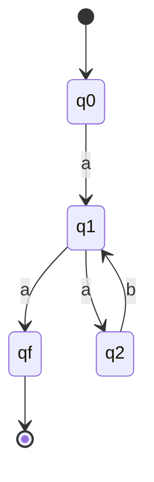
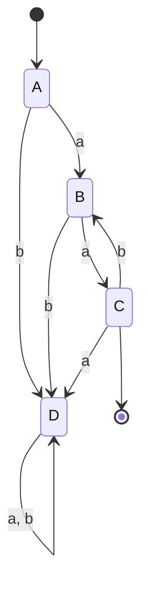

# System Software - Expected Answer Sheet

## February 2024 Mid Semester Paper

Course: CS306 - System Software  
Exam: Mid Semester Examination - February 2024  
Max Marks: 30

This write-up gives model student answers. For questions containing `OR`, both alternatives are included so the file is usable as a complete preparation sheet.

---

## Q1

### 1. Explain the following with example (any two) [2 marks]

Below are all four, though any two are sufficient in the exam.

#### OPTAB

OPTAB is the operation table of the assembler. It stores mnemonic, machine opcode, instruction format and length.

Example:

```text
MOVER -> opcode 04
ADD   -> opcode 01
STOP  -> opcode 00
```

Use: the assembler checks whether an opcode is valid and translates mnemonic to machine representation.

#### SYMTAB

SYMTAB is the symbol table. It stores user-defined symbols or labels along with their addresses.

Example:

```text
LOOP -> 205
NEXT -> 210
```

Use: required for forward references and address substitution during Pass II.

#### LITAB

LITAB is the literal table. It stores all literals used in the program and the addresses assigned to them.

Example:

```text
=5 -> 300
=1 -> 301
```

Use: literals are collected first and assigned storage during `LTORG` or `END`.

#### POOLTAB

POOLTAB stores the starting index of each literal pool in LITAB.

Example:

```text
Pool 1 starts at literal 1
Pool 2 starts at literal 4
```

Use: helps assembler know which literals belong to the current pool when `LTORG` or `END` is encountered.

---

### 2. Language processing activities [2 marks]

Language processing activities convert a high-level source program into an executable program.

Main stages:

1. Preprocessor: expands macros, includes header files, removes comments.
2. Compiler: converts high-level language into assembly language or intermediate code.
3. Assembler: converts assembly language into machine code.
4. Linker: combines object modules and library routines.
5. Loader: places the executable in memory for execution.

Example flow:

```text
C program -> Compiler -> Assembly -> Assembler -> Object code -> Linker -> Executable -> Loader -> Memory
```

---

### OR: LEX program to remove comments from a C program [2 marks]

```lex
%{
#include <stdio.h>
%}

%%
"//".*                      ;
"/*"([^*]|\*+[^*/])*"*/"   ;
(.|\n)                       ECHO;
%%

int yywrap() {
    return 1;
}

int main() {
    yylex();
    return 0;
}
```

Explanation:

1. The first rule removes single-line comments.
2. The second rule removes block comments.
3. All other characters are echoed unchanged.

---

### 3. Macro for `A * B + C * D` with result in `AREG` [2 marks]

One suitable macro is:

```text
MACRO
MULADD &A, &B, &C, &D, &R=AREG
MOVER &R, &A
MULT  &R, &B
MOVER BREG, &C
MULT  BREG, &D
ADD   &R, BREG
MEND
```

Example call:

```text
MULADD X, Y, P, Q
```

Parameter types used:

1. `&A, &B, &C, &D` are positional parameters.
2. `&R=AREG` is a keyword parameter with default value `AREG`.

So the macro computes:

```text
AREG <- A*B + C*D
```

---

### 4. Symbol Table at end of Pass I and Intermediate Code [4 marks]

Given source program:

```text
START 200
MOVER AREG, =5
MOVEM AREG, M

L1   MOVER AREG, =2
     ORIGIN L1+3
     LTORG

NEXT ADD AREG, =1
     SUB BREG, =2
     BC LT, BACK
     LTORG

BACK EQU L1
     ORIGIN NEXT+5
     MULT CREG, =4
     STOP

X    DS 2
END
```

#### Important note

As printed in the paper, symbol `M` is referenced but never defined, while `X` is defined later and never used. Therefore, the exact Pass I answer for the printed program must show `M` as unresolved. If the intended last declaration was `M DS 2`, then `M` would receive address `214`.

#### Location counter trace

| LC | Statement | Remark |
|---|---|---|
| - | `START 200` | initialize LC = 200 |
| 200 | `MOVER AREG, =5` | literal `=5` seen |
| 201 | `MOVEM AREG, M` | symbol `M` referenced |
| 202 | `L1 MOVER AREG, =2` | `L1 = 202`, literal `=2` seen |
| - | `ORIGIN L1+3` | LC becomes 205 |
| 205 | `LTORG` | assign `=5` at 205, `=2` at 206 |
| 207 | `NEXT ADD AREG, =1` | `NEXT = 207`, literal `=1` seen |
| 208 | `SUB BREG, =2` | new literal occurrence `=2` seen |
| 209 | `BC LT, BACK` | `BACK` forward reference |
| 210 | `LTORG` | assign `=1` at 210, second `=2` at 211 |
| - | `BACK EQU L1` | `BACK = 202` |
| - | `ORIGIN NEXT+5` | LC becomes 212 |
| 212 | `MULT CREG, =4` | literal `=4` seen |
| 213 | `STOP` | |
| 214 | `X DS 2` | reserve 2 words, so next LC = 216 |
| 216 | `END` | assign pending literal `=4` at 216 |

#### Symbol Table at end of Pass I

| Index | Symbol | Address |
|---|---|---|
| 1 | `M` | undefined / unresolved |
| 2 | `L1` | 202 |
| 3 | `NEXT` | 207 |
| 4 | `BACK` | 202 |
| 5 | `X` | 214 |

#### Intermediate Code

Using the usual notation:

```text
AD = Assembler Directive
IS = Imperative Statement
DL = Declarative Statement
```

Registers:

```text
AREG = 1, BREG = 2, CREG = 3
LT condition code = 1
```

One acceptable IC is:

| LC | Statement | Intermediate Code |
|---|---|---|
| - | `START 200` | `(AD,01) (C,200)` |
| 200 | `MOVER AREG, =5` | `(IS,04) (1) (L,1)` |
| 201 | `MOVEM AREG, M` | `(IS,05) (1) (S,1)` |
| 202 | `L1 MOVER AREG, =2` | `(IS,04) (1) (L,2)` |
| - | `ORIGIN L1+3` | `(AD,03) (S,2) + (C,3)` |
| 205 | `LTORG` | `(AD,05)` |
| 205 | literal `=5` | `(DL,01) (C,5)` |
| 206 | literal `=2` | `(DL,01) (C,2)` |
| 207 | `NEXT ADD AREG, =1` | `(IS,01) (1) (L,3)` |
| 208 | `SUB BREG, =2` | `(IS,02) (2) (L,4)` |
| 209 | `BC LT, BACK` | `(IS,07) (1) (S,4)` |
| 210 | `LTORG` | `(AD,05)` |
| 210 | literal `=1` | `(DL,01) (C,1)` |
| 211 | literal `=2` | `(DL,01) (C,2)` |
| - | `BACK EQU L1` | `(AD,04) (S,4) (S,2)` |
| - | `ORIGIN NEXT+5` | `(AD,03) (S,3) + (C,5)` |
| 212 | `MULT CREG, =4` | `(IS,03) (3) (L,5)` |
| 213 | `STOP` | `(IS,00)` |
| 214 | `X DS 2` | `(DL,02) (C,2)` |
| 216 | `END` | `(AD,02)` |
| 216 | literal `=4` | `(DL,01) (C,4)` |

---

## Q2

### 1. FIRST, FOLLOW, predictive parsing table, and parse `(v+v)` [5 marks]

Grammar:

```text
E -> T A
A -> + T A | - T A | e
T -> F B
B -> * F B | / F B | e
F -> - S | S
S -> v | ( E )
```

#### FIRST sets

```text
FIRST(E) = { -, v, ( }
FIRST(A) = { +, -, e }
FIRST(T) = { -, v, ( }
FIRST(B) = { *, /, e }
FIRST(F) = { -, v, ( }
FIRST(S) = { v, ( }
```

#### FOLLOW sets

```text
FOLLOW(E) = { ), $ }
FOLLOW(A) = { ), $ }
FOLLOW(T) = { +, -, ), $ }
FOLLOW(B) = { +, -, ), $ }
FOLLOW(F) = { *, /, +, -, ), $ }
FOLLOW(S) = { *, /, +, -, ), $ }
```

#### Predictive parsing table

| Non-terminal | `v` | `(` | `)` | `+` | `-` | `*` | `/` | `$` |
|---|---|---|---|---|---|---|---|---|
| `E` | `E -> TA` | `E -> TA` | - | - | `E -> TA` | - | - | - |
| `A` | - | - | `A -> e` | `A -> +TA` | `A -> -TA` | - | - | `A -> e` |
| `T` | `T -> FB` | `T -> FB` | - | - | `T -> FB` | - | - | - |
| `B` | - | - | `B -> e` | `B -> e` | `B -> e` | `B -> *FB` | `B -> /FB` | `B -> e` |
| `F` | `F -> S` | `F -> S` | - | - | `F -> -S` | - | - | - |
| `S` | `S -> v` | `S -> (E)` | - | - | - | - | - | - |

Since no cell contains more than one production, the grammar is LL(1).

#### Parsing action for `(v+v)`

Start stack: `$E`  
Input: `(v+v)$`

| Step | Stack | Input | Action |
|---|---|---|---|
| 1 | `$E` | `(v+v)$` | `E -> TA` |
| 2 | `$AT` | `(v+v)$` | `T -> FB` |
| 3 | `$ABF` | `(v+v)$` | `F -> S` |
| 4 | `$ABS` | `(v+v)$` | `S -> (E)` |
| 5 | `$AB)E(` | `(v+v)$` | match `(` |
| 6 | `$AB)E` | `v+v)$` | `E -> TA` |
| 7 | `$AB)AT` | `v+v)$` | `T -> FB` |
| 8 | `$AB)ABF` | `v+v)$` | `F -> S` |
| 9 | `$AB)ABS` | `v+v)$` | `S -> v` |
| 10 | `$AB)ABv` | `v+v)$` | match `v` |
| 11 | `$AB)AB` | `+v)$` | `B -> e` |
| 12 | `$AB)A` | `+v)$` | `A -> +TA` |
| 13 | `$AB)AT+` | `+v)$` | match `+` |
| 14 | `$AB)AT` | `v)$` | `T -> FB` |
| 15 | `$AB)ABF` | `v)$` | `F -> S` |
| 16 | `$AB)ABS` | `v)$` | `S -> v` |
| 17 | `$AB)ABv` | `v)$` | match `v` |
| 18 | `$AB)AB` | `)$` | `B -> e` |
| 19 | `$AB)A` | `)$` | `A -> e` |
| 20 | `$AB)` | `)$` | match `)` |
| 21 | `$AB` | `$` | `B -> e` |
| 22 | `$A` | `$` | `A -> e` |
| 23 | `$` | `$` | accept |

Hence the string `(v+v)` is accepted.

---

### 2. NFA and DFA for `a(ab)*a` [3 marks]

The regular expression means:

```text
one initial a,
followed by zero or more repetitions of ab,
followed by one final a
```

So accepted strings are:

```text
aa, aaba, aababa, aabababa, ...
```

#### NFA

One valid NFA is:



Here:

1. `q0` is start state.
2. `qf` is final state.
3. From `q1`, one `a` can directly finish the string.
4. Or it can move to `q2`, read `b`, come back to `q1`, and repeat `(ab)` any number of times.

#### DFA by subset construction

Let:

```text
A = {q0}
B = {q1}
C = {q2, qf}
D = dead state
```



Transition table:

| State | `a` | `b` | Final? |
|---|---|---|---|
| `A` | `B` | `D` | No |
| `B` | `C` | `D` | No |
| `C` | `D` | `B` | Yes |
| `D` | `D` | `D` | No |

Thus `C` is the accepting DFA state because it contains `qf`.

---

### OR: Transition diagrams for comments and identifiers in C [3 marks]

#### 1. Comments in C

For single-line comment `//...`:

```text
q0 --/--> q1 --/--> q2
q2 --any character except newline--> q2
q2 --newline--> accept
```

For block comment `/* ... */`:

```text
q0 --/--> q1 --*--> q3
q3 --any char except *--> q3
q3 --*--> q4
q4 --/--> accept
q4 --*--> q4
q4 --other--> q3
```

#### 2. Identifier in C

Rule: an identifier starts with letter or `_`, followed by letters, digits or `_`.

Transition diagram:

```text
q0 --letter or _--> q1
q1 --letter or digit or _--> q1
```

`q1` is the accepting state.

---

### 3. Check whether the grammar is LL(1), construct predictive parse table, explain steps [4 marks]

Grammar:

```text
S -> 0 | 1S2S3 | 1A3
A -> S | AS
```

#### FIRST sets

```text
FIRST(S) = { 0, 1 }
FIRST(A) = { 0, 1 }
```

#### Observations

1. `S -> 1S2S3` and `S -> 1A3` have the same FIRST symbol `1`.
2. `A -> AS` is directly left recursive.

Therefore the grammar cannot be LL(1).

#### Predictive parse table (showing conflict)

| Non-terminal | `0` | `1` | `2` | `3` | `$` |
|---|---|---|---|---|---|
| `S` | `S -> 0` | `S -> 1S2S3` and `S -> 1A3` | error | error | error |
| `A` | `A -> S` and `A -> AS` | `A -> S` and `A -> AS` | error | error | error |

Since entries contain multiple productions, the parse table has conflicts.

Hence:

```text
The grammar is NOT LL(1).
```

#### Steps used in constructing predictive parse table

1. Compute FIRST set of every non-terminal.
2. For each production `A -> alpha`, place it in `M[A, a]` for each `a` in `FIRST(alpha)`.
3. If `alpha` can derive epsilon, then place it in columns of `FOLLOW(A)` also.
4. If any table cell gets more than one production, the grammar is not LL(1).

This grammar fails because of common-prefix conflict and left recursion.

---

### 4. Eliminate left recursion and perform left factoring [2 marks]

Grammar:

```text
S -> A
A -> Ad | Ae | aB | ac
B -> bBc | f
```

`A` has direct left recursion due to `Ad` and `Ae`.

Take:

```text
alpha = d, e
beta  = aB, ac
```

After removing left recursion:

```text
S  -> A
A  -> aB A' | ac A'
A' -> dA' | eA' | e
B  -> bBc | f
```

Now left factor `A`:

```text
S  -> A
A  -> a X A'
X  -> B | c
A' -> dA' | eA' | e
B  -> bBc | f
```

This is the required grammar.

---

### 5. (a) Define tokens, lexemes, pattern [4 marks total with part b]

#### Token

A token is a category of lexical unit returned by the lexical analyser.

Examples: `id`, `num`, `if`, `+`, `;`

#### Lexeme

A lexeme is the actual sequence of characters in the source program that matches a token pattern.

Examples:

1. `count` is a lexeme of token `id`
2. `123` is a lexeme of token `num`

#### Pattern

A pattern is the rule that describes all lexemes belonging to a token.

Example:

```text
identifier pattern = letter (letter | digit)*
```

---

### 5. (b) Total number of lexemes in the given code [continued]

Given code:

```c
#include
#include

int main()
{
    printf("%d + %d = %d",3,1,4); /*sum*/
    return 0;
}
```

Counting all program lexemes except whitespace/newlines, one acceptable count is:

```text
1  #include
2  #include
3  int
4  main
5  (
6  )
7  {
8  printf
9  (
10 "%d + %d = %d"
11 ,
12 3
13 ,
14 1
15 ,
16 4
17 )
18 ;
19 /*sum*/
20 return
21 0
22 ;
23 }
```

Therefore, if the comment is counted as one lexeme, the total number of lexemes is:

```text
23
```

If a teacher ignores comments during lexical counting, the answer becomes `22`. In most compiler-style counting, mentioning this assumption is the safest way to write the answer.

---

### 6. Check whether the grammar is ambiguous for string `aabbccdd` [2 marks]

Grammar:

```text
S -> AB | C
A -> aAb | ab
B -> cBd | cd
C -> aCd | aDd
D -> bDc | bc
```

We show two different derivations for the same string `aabbccdd`.

#### Derivation 1: through `AB`

```text
S => AB
  => aAb B
  => a(ab)b B
  => aabb B
  => aabb cBd
  => aabb c(cd)d
  => aabbccdd
```

#### Derivation 2: through `C`

```text
S => C
  => aCd
  => aaDdd
  => aabDcdd
  => aabbccdd
```

Thus the same string has two distinct derivations.

Therefore, the grammar is:

```text
ambiguous
```

---

## Quick Revision Summary

Important answers from this paper:

1. Q2.1 grammar is LL(1), and `(v+v)` is accepted.
2. Q2.3 grammar is not LL(1).
3. Q2.6 grammar is ambiguous because `aabbccdd` has two derivations.
4. In Q1.4, the printed program leaves symbol `M` unresolved unless the paper intended `M DS 2` instead of `X DS 2`.
