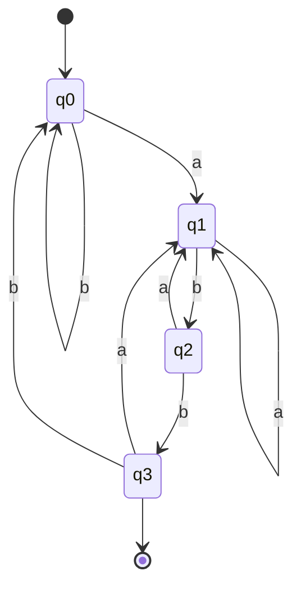

# System Software - Mid Semester Examination Solutions

## March 2020

Institute: SVNIT, Surat  
Course: CO304 - System Software  
Exam: Mid Semester Examination  
Date: 03-03-2020  
Max Marks: 30

The answers below are written in standard college-exam style. For questions having `OR`, both alternatives are included for preparation.

---

## Q1

### 1. Explain Language Processing Activities. [3 marks]

Language processing activities are the various steps used to translate a source program into an executable form.

The main activities are as follows.

#### (a) Preprocessing

The preprocessor processes the source program before compilation.

It performs:

1. macro expansion,
2. file inclusion,
3. comment removal,
4. conditional compilation.

#### (b) Compilation

The compiler translates the high-level language program into assembly language or intermediate code.

It performs lexical, syntax and semantic analysis.

#### (c) Assembly

The assembler converts assembly language into machine language object code.

#### (d) Linking

The linker combines different object modules and library routines.

#### (e) Loading

The loader places the executable program into main memory for execution.

#### Overall flow

```text
Source Program -> Preprocessor -> Compiler -> Assembler -> Linker -> Loader -> Execution
```

Hence, language processing activities transform a user program into an executable machine-level program.

---

### 2. Assembly Language Program: Intermediate Code, Target Code, SYMTAB, LITTAB, POOLTAB [7 marks]

Given program:

```text
START   205
MOVER   AREG, ='6'
MOVEM   AREG, A

LOOP    MOVER   AREG, A
        MOVER   CREG, B
        ADD     CREG, ='2'
        BC      ANY, NEXT
        LTORG

        ADD     BREG, B

NEXT    SUB     AREG, ='1'
        BC      LT, BACK

LAST    STOP
        ORIGIN  LOOP-3
        MULT    CREG, B

        ORIGIN  LAST+1
A       DS      1

BACK    EQU     LOOP
B       DS      1
END
```

#### Standard opcode and register conventions used

```text
STOP  = (IS,00)
ADD   = (IS,01)
SUB   = (IS,02)
MULT  = (IS,03)
MOVER = (IS,04)
MOVEM = (IS,05)
BC    = (IS,07)

START  = (AD,01)
END    = (AD,02)
ORIGIN = (AD,03)
EQU    = (AD,04)
LTORG  = (AD,05)

DS     = (DL,02)
DC     = (DL,01)

AREG = 1, BREG = 2, CREG = 3
LT = 1, ANY = 6
```

### (a) LC processing

| LC | Statement | Remark |
|---|---|---|
| - | `START 205` | Initialize LC = 205 |
| 205 | `MOVER AREG, ='6'` | literal `='6'` entered in LITTAB |
| 206 | `MOVEM AREG, A` | symbol `A` forward reference |
| 207 | `LOOP MOVER AREG, A` | `LOOP = 207` |
| 208 | `MOVER CREG, B` | symbol `B` forward reference |
| 209 | `ADD CREG, ='2'` | literal `='2'` entered |
| 210 | `BC ANY, NEXT` | symbol `NEXT` forward reference |
| 211 | `LTORG` | assign `='6'` at 211, `='2'` at 212 |
| 213 | `ADD BREG, B` | |
| 214 | `NEXT SUB AREG, ='1'` | `NEXT = 214`, literal `='1'` entered |
| 215 | `BC LT, BACK` | symbol `BACK` forward reference |
| 216 | `LAST STOP` | `LAST = 216` |
| - | `ORIGIN LOOP-3` | LC = 207 - 3 = 204 |
| 204 | `MULT CREG, B` | |
| - | `ORIGIN LAST+1` | LC = 216 + 1 = 217 |
| 217 | `A DS 1` | `A = 217` |
| - | `BACK EQU LOOP` | `BACK = 207` |
| 218 | `B DS 1` | `B = 218` |
| 219 | `END` | assign pending literal `='1'` at 219 |

### (b) Intermediate Code

| LC | Statement | Intermediate Code |
|---|---|---|
| - | `START 205` | `(AD,01) (C,205)` |
| 205 | `MOVER AREG, ='6'` | `(IS,04) (1) (L,1)` |
| 206 | `MOVEM AREG, A` | `(IS,05) (1) (S,4)` |
| 207 | `LOOP MOVER AREG, A` | `(IS,04) (1) (S,4)` |
| 208 | `MOVER CREG, B` | `(IS,04) (3) (S,6)` |
| 209 | `ADD CREG, ='2'` | `(IS,01) (3) (L,2)` |
| 210 | `BC ANY, NEXT` | `(IS,07) (6) (S,2)` |
| - | `LTORG` | `(AD,05)` |
| 211 | `='6'` | `(DL,01) (C,6)` |
| 212 | `='2'` | `(DL,01) (C,2)` |
| 213 | `ADD BREG, B` | `(IS,01) (2) (S,6)` |
| 214 | `NEXT SUB AREG, ='1'` | `(IS,02) (1) (L,3)` |
| 215 | `BC LT, BACK` | `(IS,07) (1) (S,5)` |
| 216 | `LAST STOP` | `(IS,00)` |
| - | `ORIGIN LOOP-3` | `(AD,03) (S,1) - (C,3)` |
| 204 | `MULT CREG, B` | `(IS,03) (3) (S,6)` |
| - | `ORIGIN LAST+1` | `(AD,03) (S,3) + (C,1)` |
| 217 | `A DS 1` | `(DL,02) (C,1)` |
| - | `BACK EQU LOOP` | `(AD,04) (S,5) (S,1)` |
| 218 | `B DS 1` | `(DL,02) (C,1)` |
| - | `END` | `(AD,02)` |
| 219 | `='1'` | `(DL,01) (C,1)` |

#### Symbol table numbering used above

| Symbol No. | Symbol | Address |
|---|---|---|
| 1 | `LOOP` | 207 |
| 2 | `NEXT` | 214 |
| 3 | `LAST` | 216 |
| 4 | `A` | 217 |
| 5 | `BACK` | 207 |
| 6 | `B` | 218 |

### (c) Target Code

Target code is written in the standard form:

```text
opcode   register/condition   memory address
```

| LC | Target code |
|---|---|
| 205 | `04 1 211` |
| 206 | `05 1 217` |
| 207 | `04 1 217` |
| 208 | `04 3 218` |
| 209 | `01 3 212` |
| 210 | `07 6 214` |
| 211 | `00 0 006` |
| 212 | `00 0 002` |
| 213 | `01 2 218` |
| 214 | `02 1 219` |
| 215 | `07 1 207` |
| 216 | `00 0 000` |
| 204 | `03 3 218` |
| 217 | `---` reserved by `DS 1` |
| 218 | `---` reserved by `DS 1` |
| 219 | `00 0 001` |

### (d) Required tables

#### SYMTAB

| Symbol | Address |
|---|---|
| `LOOP` | 207 |
| `NEXT` | 214 |
| `LAST` | 216 |
| `A` | 217 |
| `BACK` | 207 |
| `B` | 218 |

#### LITTAB

| Literal No. | Literal | Address |
|---|---|---|
| 1 | `='6'` | 211 |
| 2 | `='2'` | 212 |
| 3 | `='1'` | 219 |

#### POOLTAB

| Pool No. | Starting LITTAB index |
|---|---|
| 1 | 1 |
| 2 | 3 |

---

## Q2

### 1. Define the following terms: (a) Lexemes (b) Pattern [2 marks]

#### Lexeme

A lexeme is the actual sequence of characters in the source program that matches a token pattern.

Examples:

1. `count`
2. `25`
3. `while`

#### Pattern

A pattern is the rule that describes the set of lexemes belonging to a token.

Example:

```text
identifier -> letter (letter | digit)*
```

Thus `abc`, `x1`, `temp2` are lexemes matching the identifier pattern.

---

### OR: Regular expression for all strings ending with `abb` and equivalent DFA [2 marks]

Regular expression:

```text
(a|b)*abb
```

Equivalent DFA can be represented by four states.



| State | `a` | `b` | Meaning |
|---|---|---|---|
| `q0` | `q1` | `q0` | No useful suffix found |
| `q1` | `q1` | `q2` | Last symbol sequence is `a` |
| `q2` | `q1` | `q3` | Last symbol sequence is `ab` |
| `q3` | `q1` | `q0` | Last symbol sequence is `abb`, final state |

Hence `q3` is the accepting state.

---

### 2. Rightmost derivation and parse tree for `(id * id) / id + id - id` [2 marks]

Grammar:

```text
E -> E + T | E - T | T
T -> T * F | T / F | F
F -> id | (E)
```

#### Rightmost derivation

```text
E
=> E - T
=> E - F
=> E - id
=> E + T - id
=> E + F - id
=> E + id - id
=> T + id - id
=> T / F + id - id
=> T / id + id - id
=> F / id + id - id
=> (E) / id + id - id
=> (T) / id + id - id
=> (T * F) / id + id - id
=> (T * id) / id + id - id
=> (F * id) / id + id - id
=> (id * id) / id + id - id
```

#### Parse tree

```text
                 E
              /  |  \
             E   -   T
          /  |  \     \
         E   +   T     id
         |      /|\
         T     T / F
         |     |   |
         F     F   id
         |     |
       ( E )  (E)
         |      \
         T      T * F
         |      |   |
         F      F   id
         |      |
        id     id
```

Hence the given string is derived correctly.

---

### 3. FIRST and FOLLOW set for the grammar [2 marks]

Grammar:

```text
statement -> if-stmt | other
if-stmt   -> if (exp) statement else-part
else-part -> else statement | epsilon
exp       -> 0 | 1
```

#### FIRST sets

```text
FIRST(statement) = { if, other }
FIRST(if-stmt)   = { if }
FIRST(else-part) = { else, epsilon }
FIRST(exp)       = { 0, 1 }
```

#### FOLLOW sets

```text
FOLLOW(statement) = { $, else }
FOLLOW(if-stmt)   = { $, else }
FOLLOW(else-part) = { $, else }
FOLLOW(exp)       = { ) }
```

---

### 4. Eliminate left recursion, if any, from the grammar. [2 marks]

Grammar:

```text
A -> Br | x
B -> Cs | y
C -> At | z
```

This grammar has indirect left recursion.

#### Step 1: substitute `A` in `C -> At`

```text
C -> Brt | xt | z
```

#### Step 2: substitute `B -> Cs | y`

```text
C -> Csrt | yrt | xt | z
```

Now direct left recursion appears in `C -> Csrt`.

#### Step 3: remove direct left recursion

```text
C  -> yrt C' | xt C' | z C'
C' -> srt C' | epsilon
```

So the final grammar without left recursion is:

```text
A  -> Br | x
B  -> Cs | y
C  -> yrt C' | xt C' | z C'
C' -> srt C' | epsilon
```

---

### OR: Define left factoring and eliminate left factoring from `S -> a | ab | abc | abcd` [2 marks]

#### Definition

Left factoring is the transformation in which common prefixes are removed so that the parser can decide the correct production by looking ahead.

#### Left factoring

```text
S  -> a A
A  -> b B | epsilon
B  -> c C | epsilon
C  -> d | epsilon
```

This is the left-factored grammar.

---

### 5. Develop LL(1) parsing table and parse `(id * id) + (id * id)` [4 marks]

Grammar:

```text
E -> T A
A -> + T A | epsilon
T -> V B
B -> * V B | epsilon
V -> id | (E)
```

#### FIRST sets

```text
FIRST(E) = { id, ( }
FIRST(A) = { +, epsilon }
FIRST(T) = { id, ( }
FIRST(B) = { *, epsilon }
FIRST(V) = { id, ( }
```

#### FOLLOW sets

```text
FOLLOW(E) = { ), $ }
FOLLOW(A) = { ), $ }
FOLLOW(T) = { +, ), $ }
FOLLOW(B) = { +, ), $ }
FOLLOW(V) = { *, +, ), $ }
```

#### LL(1) parsing table

| Non-terminal | `id` | `(` | `)` | `+` | `*` | `$` |
|---|---|---|---|---|---|---|
| `E` | `E -> TA` | `E -> TA` | - | - | - | - |
| `A` | - | - | `A -> epsilon` | `A -> +TA` | - | `A -> epsilon` |
| `T` | `T -> VB` | `T -> VB` | - | - | - | - |
| `B` | - | - | `B -> epsilon` | `B -> epsilon` | `B -> *VB` | `B -> epsilon` |
| `V` | `V -> id` | `V -> (E)` | - | - | - | - |

#### Parsing trace

Input:

```text
( id * id ) + ( id * id ) $
```

Initial stack:

```text
$ E
```

Compact trace:

| Step | Stack | Input | Action |
|---|---|---|---|
| 1 | `$ E` | `(id*id)+(id*id)$` | `E -> TA` |
| 2 | `$ A T` | `(id*id)+(id*id)$` | `T -> VB` |
| 3 | `$ A B V` | `(id*id)+(id*id)$` | `V -> (E)` |
| 4 | `$ A B ) E (` | `(id*id)+(id*id)$` | match `(` |
| 5 | `$ A B ) E` | `id*id)+(id*id)$` | `E -> TA` |
| 6 | `$ A B ) A T` | `id*id)+(id*id)$` | `T -> VB` |
| 7 | `$ A B ) A B V` | `id*id)+(id*id)$` | `V -> id` |
| 8 | `$ A B ) A B id` | `id*id)+(id*id)$` | match `id` |
| 9 | `$ A B ) A B` | `*id)+(id*id)$` | `B -> *VB` |
| 10 | `$ A B ) A B V *` | `*id)+(id*id)$` | match `*` |
| 11 | `$ A B ) A B V` | `id)+(id*id)$` | `V -> id` |
| 12 | `$ A B ) A B id` | `id)+(id*id)$` | match `id` |
| 13 | `$ A B ) A B` | `)+(id*id)$` | `B -> epsilon` |
| 14 | `$ A B ) A` | `)+(id*id)$` | `A -> epsilon` |
| 15 | `$ A B )` | `)+(id*id)$` | match `)` |
| 16 | `$ A B` | `+(id*id)$` | `B -> epsilon` |
| 17 | `$ A` | `+(id*id)$` | `A -> +TA` |
| 18 | `$ A T +` | `+(id*id)$` | match `+` |
| 19 | `$ A T` | `(id*id)$` | `T -> VB` |
| 20 | `$ A B V` | `(id*id)$` | `V -> (E)` |
| 21 | `$ A B ) E (` | `(id*id)$` | match `(` |
| 22 | `$ A B ) E` | `id*id)$` | `E -> TA` |
| 23 | `$ A B ) A T` | `id*id)$` | `T -> VB` |
| 24 | `$ A B ) A B V` | `id*id)$` | `V -> id` |
| 25 | `$ A B ) A B id` | `id*id)$` | match `id` |
| 26 | `$ A B ) A B` | `*id)$` | `B -> *VB` |
| 27 | `$ A B ) A B V *` | `*id)$` | match `*` |
| 28 | `$ A B ) A B V` | `id)$` | `V -> id` |
| 29 | `$ A B ) A B id` | `id)$` | match `id` |
| 30 | `$ A B ) A B` | `)$` | `B -> epsilon` |
| 31 | `$ A B ) A` | `)$` | `A -> epsilon` |
| 32 | `$ A B )` | `)$` | match `)` |
| 33 | `$ A B` | `$` | `B -> epsilon` |
| 34 | `$ A` | `$` | `A -> epsilon` |
| 35 | `$` | `$` | accept |

Hence the string is accepted.

---

### OR: Predictive parsing table for `S -> Aa | b`, `A -> bdC | C`, `C -> abC | cC | epsilon` [4 marks]

First observe:

```text
FIRST(C) = { a, c, epsilon }
FIRST(A) = { a, b, c, epsilon }
FIRST(S) = { a, b, c }
```

For non-terminal `S`:

1. `S -> Aa` can begin with `b` because `A -> bdC`.
2. `S -> b` also begins with `b`.

Therefore there is a conflict in the parsing table at `M[S, b]`.

Hence the grammar is **not LL(1)**.

Also, the input string `bdcea` contains terminal `e`, but `e` does not occur anywhere in the grammar. Therefore the string cannot be parsed by this grammar as written.

---

### 6. Explain various phases of the compiler. Also write the output of `a = b * c + c * b` after each phase. [4 marks]

The major phases of a compiler are as follows.

#### (a) Lexical analysis

It converts source program into tokens.

Output:

```text
id(a)  =  id(b)  *  id(c)  +  id(c)  *  id(b)
```

#### (b) Syntax analysis

It checks grammatical correctness and builds parse tree or syntax tree.

Tree reflects precedence as:

```text
     =
   /   \
  a     +
       / \
      *   *
     / \ / \
    b  c c  b
```

#### (c) Semantic analysis

It checks type compatibility and meaning.

Output is an annotated syntax tree. If all variables are integers, the expression is semantically valid.

#### (d) Intermediate code generation

```text
t1 = b * c
t2 = c * b
t3 = t1 + t2
a  = t3
```

#### (e) Code optimization

Since `b*c` and `c*b` are equivalent, common subexpression elimination can be applied.

Optimized code:

```text
t1 = b * c
t2 = t1 + t1
a  = t2
```

#### (f) Target code generation

Example target-like code:

```text
MOV R1, b
MUL R1, c
ADD R1, R1
MOV a, R1
```

Hence, each compiler phase produces a more refined form of the input program.

---

### 7. Design LL(1) parsing table for the grammar [4 marks]

Given grammar:

```text
bexpr   -> bexpr or bterm | bterm
bterm   -> bterm and bfactor | bfactor
bfactor -> not bfactor | (bexpr) | true | false
```

The given grammar is not directly LL(1) because it is left recursive.

So first remove left recursion.

#### Equivalent LL(1) grammar

```text
E  -> T E'
E' -> or T E' | epsilon
T  -> F T'
T' -> and F T' | epsilon
F  -> not F | (E) | true | false
```

#### FIRST sets

```text
FIRST(E)  = { not, (, true, false }
FIRST(E') = { or, epsilon }
FIRST(T)  = { not, (, true, false }
FIRST(T') = { and, epsilon }
FIRST(F)  = { not, (, true, false }
```

#### FOLLOW sets

```text
FOLLOW(E)  = { ), $ }
FOLLOW(E') = { ), $ }
FOLLOW(T)  = { or, ), $ }
FOLLOW(T') = { or, ), $ }
FOLLOW(F)  = { and, or, ), $ }
```

#### LL(1) parsing table

| Non-terminal | `not` | `(` | `true` | `false` | `or` | `and` | `)` | `$` |
|---|---|---|---|---|---|---|---|---|
| `E` | `E -> T E'` | `E -> T E'` | `E -> T E'` | `E -> T E'` | - | - | - | - |
| `E'` | - | - | - | - | `E' -> or T E'` | - | `E' -> epsilon` | `E' -> epsilon` |
| `T` | `T -> F T'` | `T -> F T'` | `T -> F T'` | `T -> F T'` | - | - | - | - |
| `T'` | - | - | - | - | `T' -> epsilon` | `T' -> and F T'` | `T' -> epsilon` | `T' -> epsilon` |
| `F` | `F -> not F` | `F -> (E)` | `F -> true` | `F -> false` | - | - | - | - |

Hence the transformed grammar is LL(1), and the above is the required parsing table.

---

## End of Solution
