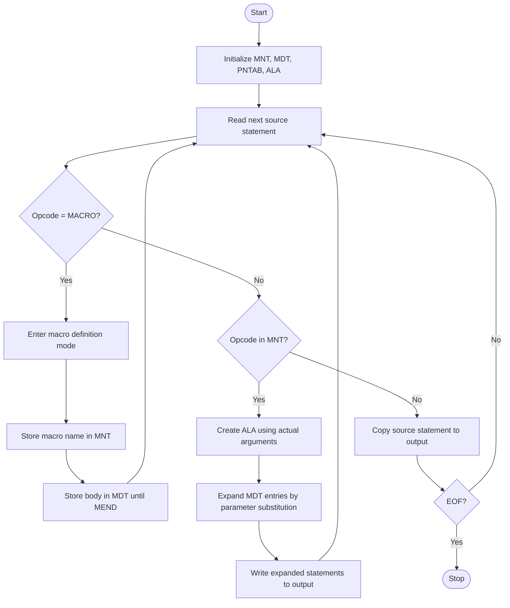
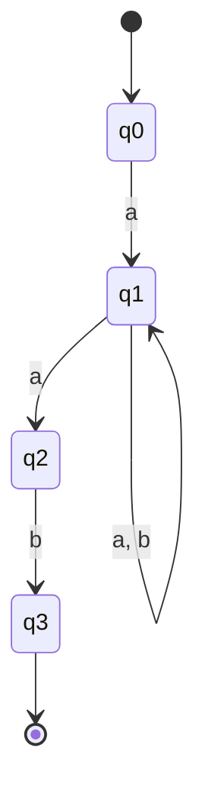
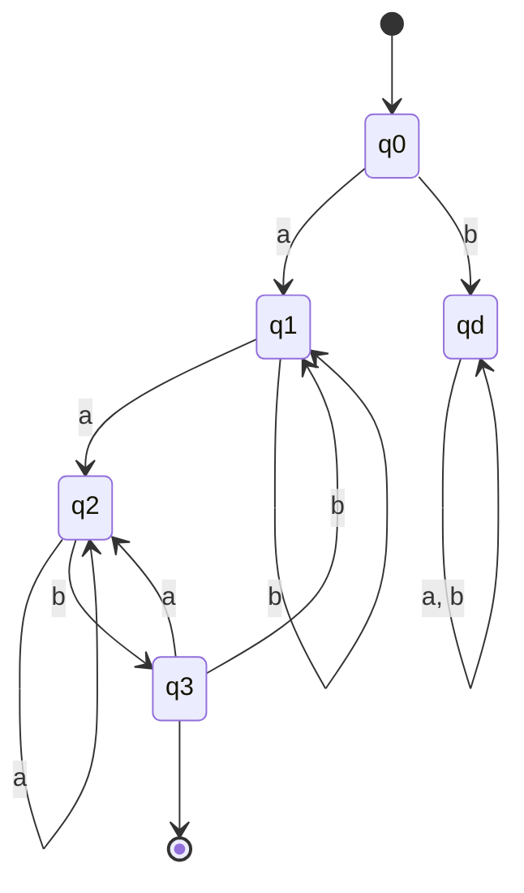
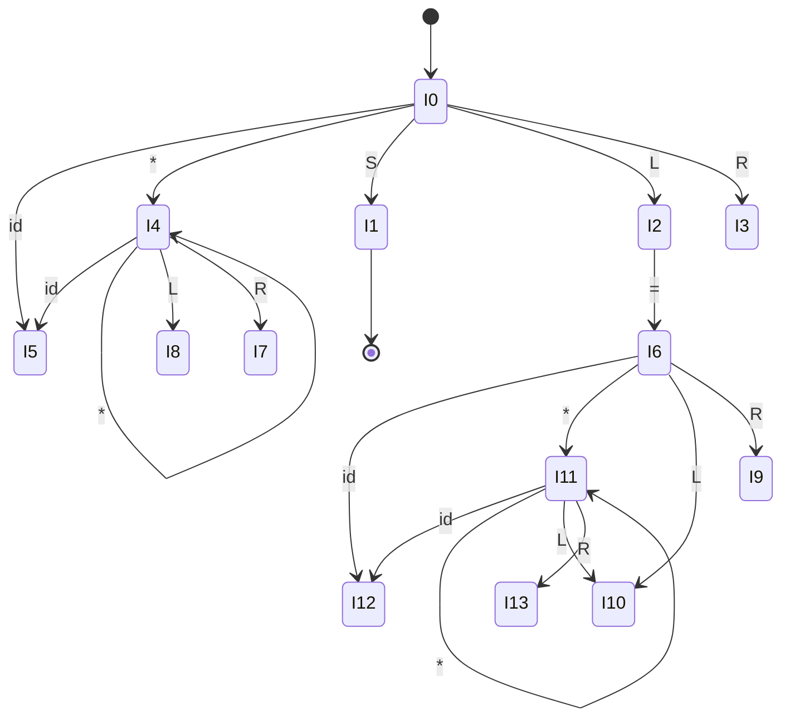

# System Software - Mid Semester Examination Solutions

## March 2023

Institute: SVNIT, Surat  
Course: CS306 - System Software  
Exam: Mid Semester Examination  
Max Marks: 30

The following answers are written in the usual Indian college examination style: definition first, short explanation next, example where needed, and final result clearly stated.

---

## Q1

### 1. Explain with example generation time activities, keyword parameters, expansion time variables, conditional assembly with respect to macro assembler. [4 marks]

#### (a) Generation time activities

Generation time activities are those activities performed by the macro processor during macro expansion, before the final assembly code is produced.

These activities include:

1. Parameter substitution.
2. Expansion of model statements.
3. Evaluation of expansion-time expressions.
4. Deciding whether a statement should be generated or skipped.

Example:

```text
MACRO
INCR &ARG
MOVER AREG, &ARG
ADD   AREG, =1
MEND
```

When `INCR X` is called, the statements with `X` substituted are generated at macro expansion time.

#### (b) Keyword parameters

Keyword parameters are macro parameters supplied by name. They may also have default values.

Example:

```text
MACRO
LOAD &ARG, &REG=AREG
MOVER &REG, &ARG
MEND
```

Calls:

```text
LOAD NUM
LOAD NUM, &REG=BREG
```

Here `REG` is a keyword parameter with default value `AREG`.

#### (c) Expansion time variables

Expansion time variables are special variables used only during macro expansion. Their values are computed and used by the macro processor, not by the target program.

They are generally written with a variable notation such as `&COUNT`, `&I`, etc.

Example:

```text
&I SET 1
```

Such a variable can be used to control repetition or conditional expansion.

#### (d) Conditional assembly

Conditional assembly means selection of different statements during macro expansion depending on a condition.

Pseudo-operations used are typically `AIF` and `AGO`.

Example:

```text
MACRO
COMPARE &X, &Y, &MODE=LT
AIF ('&MODE' EQ 'LT') LESS
MOVER AREG, &X
COMP  AREG, &Y
AGO   ENDL
LESS  MOVER BREG, &X
COMP  BREG, &Y
ENDL  MEND
```

Hence, different assembly statements are generated depending on the value of `MODE`.

---

### 2. Compare and contrast between various approaches to symbol table organization. [3 marks]

Symbol table is used by assemblers, macro processors and compilers to store names and their attributes.

Common approaches are as follows.

| Approach | Search time | Insertion time | Merits | Demerits |
|---|---|---|---|---|
| Linear list | Slow, `O(n)` | Easy | Very simple | Inefficient for large tables |
| Ordered array/list | `O(log n)` by binary search | Costly, because shifting required | Faster search than linear list | Insertion expensive |
| Binary search tree | Average `O(log n)` | Average `O(log n)` | Maintains sorted order | May become unbalanced |
| Hash table | Average `O(1)` | Average `O(1)` | Fastest in practice | Collision handling needed |

Comparison:

1. Linear list is suitable only for very small programs.
2. Ordered lists improve searching but worsen insertion.
3. Trees are useful when ordered traversal is needed.
4. Hash tables are most commonly used in practical compilers because both insertion and search are fast.

Hence, hash table organization is generally preferred.

---

### 3. Draw and explain flowchart for One Pass Macro Pre-Processor without nested macro calls. [3 marks]

In one-pass macro preprocessing, macro definition and macro expansion are handled in a single scan of the source program.

#### Flow of one-pass macro pre-processor



#### Explanation

1. If `MACRO` is found, the processor enters definition mode.
2. Macro name is entered into MNT and macro body into MDT.
3. When a macro call is later found, actual parameters are mapped in ALA.
4. The body is copied from MDT with suitable substitution.
5. Since nested macro calls are not allowed, expanded statements are not recursively expanded again.

---

## Q2

### 1. Convert the regular expression into NFA and DFA: `a(a|b)*ab` [3 marks]

The given regular expression is:

```text
a(a|b)*ab
```

This means:

1. the string must start with `a`,
2. then any number of `a` or `b` may occur,
3. and the string must end with `ab`.

Examples accepted are:

```text
aab, aaab, abab, aabab, abbab
```

#### NFA

One valid NFA is:



Where:

1. `q0` is the start state.
2. `q3` is the final state.
3. The loop on `q1` represents `(a|b)*`.
4. The path `q1 --a--> q2 --b--> q3` ensures the string ends with `ab`.

#### DFA

A deterministic automaton can be written as follows.

States:

1. `q0` = start state
2. `q1` = initial `a` has been seen, now scanning middle part
3. `q2` = last useful symbol seen is `a`
4. `q3` = suffix `ab` recognized, final state
5. `qd` = dead state



Transition table:

| State | `a` | `b` | Final? |
|---|---|---|---|
| `q0` | `q1` | `qd` | No |
| `q1` | `q2` | `q1` | No |
| `q2` | `q2` | `q3` | No |
| `q3` | `q2` | `q1` | Yes |
| `qd` | `qd` | `qd` | No |

Hence, `q3` is the only accepting state.

---

### 2. Explain analysis and synthesis phases of compiler with example. [2 marks]

The compiler is broadly divided into two major parts.

#### Analysis phase

This is the front-end of the compiler. It analyzes the source program and breaks it into meaningful components.

It includes:

1. lexical analysis,
2. syntax analysis,
3. semantic analysis,
4. intermediate code generation.

Example:

For the statement:

```text
a = b + c * d
```

the analysis phase checks tokens, grammar and meaning, and then forms an intermediate representation.

#### Synthesis phase

This is the back-end of the compiler. It takes intermediate code and generates target code.

It includes:

1. code optimization,
2. target code generation.

Example:

Intermediate code such as:

```text
t1 = c * d
t2 = b + t1
a = t2
```

is converted into suitable assembly or machine code.

Hence, analysis phase breaks the program into components, while synthesis phase constructs the final target program.

---

### 3. What do you mean by Top Down Parsing? Explain Recursive Descent Parsing using Backtracking with example. [3 marks]

#### Top Down Parsing

Top down parsing is a parsing technique in which the parse tree is constructed from the start symbol towards the terminals. It attempts to derive the input string by expanding the leftmost non-terminal.

#### Recursive Descent Parsing with Backtracking

Recursive descent parsing is a top down parsing method in which one procedure is written for each non-terminal.

If more than one production is possible, the parser tries one production first. If it fails later, it returns to the earlier choice point and tries another production. This is called backtracking.

#### Example

Consider the grammar:

```text
S -> aA
A -> b | bc
```

Input string:

```text
abc
```

Working:

1. Start with `S -> aA`.
2. Input `a` matches.
3. For `A`, first try `A -> b`.
4. `b` matches, but one symbol `c` remains unconsumed.
5. So parser backtracks.
6. Now try `A -> bc`.
7. Both `b` and `c` match, so the string is accepted.

Hence, recursive descent with backtracking is simple, but inefficient because some input may be scanned more than once.

---

### 4. Draw the LR(1) DFA from the given grammar and parse table. [6 marks]

Grammar:

```text
S -> L = R
S -> R
L -> *R
L -> id
R -> L
```

The LR(1) DFA can be directly obtained from the shift and goto entries of the parsing table.

#### DFA transitions



From state `0`:

```text
0 --id--> 5
0 --*--> 4
0 --S--> 1
0 --L--> 2
0 --R--> 3
```

From state `2`:

```text
2 --=--> 6
```

From state `4`:

```text
4 --id--> 5
4 --*--> 4
4 --L--> 8
4 --R--> 7
```

From state `6`:

```text
6 --id--> 12
6 --*--> 11
6 --L--> 10
6 --R--> 9
```

From state `11`:

```text
11 --id--> 12
11 --*--> 11
11 --L--> 10
11 --R--> 13
```

#### Reducing and accepting states

1. State `1` is accepting state.
2. States `3, 5, 7, 8, 9, 10, 12, 13` are reducing states according to the table.

#### Production numbers

```text
r1: S -> L = R
r2: S -> R
r3: L -> *R
r4: L -> id
r5: R -> L
```

Thus the LR(1) DFA is completely represented by the above transitions and reduce states.

---

### 5. FIRST, FOLLOW, LL(1) parsing table and parsing of `ID -- ID((ID))` [6 marks]

Grammar:

```text
Expr     -> -Expr | (Expr) | Var ExprTail
ExprTail -> -Expr | epsilon
Var      -> ID VarTail
VarTail  -> (Expr) | epsilon
```

#### FIRST sets

```text
FIRST(Expr)     = { -, (, ID }
FIRST(ExprTail) = { -, epsilon }
FIRST(Var)      = { ID }
FIRST(VarTail)  = { (, epsilon }
```

#### FOLLOW sets

```text
FOLLOW(Expr)     = { ), $ }
FOLLOW(ExprTail) = { ), $ }
FOLLOW(Var)      = { -, ), $ }
FOLLOW(VarTail)  = { -, ), $ }
```

#### LL(1) parsing table

| Non-terminal | `ID` | `-` | `(` | `)` | `$` |
|---|---|---|---|---|---|
| `Expr` | `Expr -> Var ExprTail` | `Expr -> -Expr` | `Expr -> (Expr)` | - | - |
| `ExprTail` | - | `ExprTail -> -Expr` | - | `ExprTail -> epsilon` | `ExprTail -> epsilon` |
| `Var` | `Var -> ID VarTail` | - | - | - | - |
| `VarTail` | - | `VarTail -> epsilon` | `VarTail -> (Expr)` | `VarTail -> epsilon` | `VarTail -> epsilon` |

Since each table entry contains at most one production, the grammar is LL(1).

#### Parsing the string `ID -- ID((ID))`

Token sequence:

```text
ID  -  -  ID  (  (  ID  )  )  $
```

Initial stack:

```text
$ Expr
```

Trace:

| Step | Stack | Input | Action |
|---|---|---|---|
| 1 | `$ Expr` | `ID - - ID ( ( ID ) ) $` | `Expr -> Var ExprTail` |
| 2 | `$ ExprTail Var` | `ID - - ID ( ( ID ) ) $` | `Var -> ID VarTail` |
| 3 | `$ ExprTail VarTail ID` | `ID - - ID ( ( ID ) ) $` | match `ID` |
| 4 | `$ ExprTail VarTail` | `- - ID ( ( ID ) ) $` | `VarTail -> epsilon` |
| 5 | `$ ExprTail` | `- - ID ( ( ID ) ) $` | `ExprTail -> -Expr` |
| 6 | `$ Expr -` | `- - ID ( ( ID ) ) $` | match `-` |
| 7 | `$ Expr` | `- ID ( ( ID ) ) $` | `Expr -> -Expr` |
| 8 | `$ Expr -` | `- ID ( ( ID ) ) $` | match `-` |
| 9 | `$ Expr` | `ID ( ( ID ) ) $` | `Expr -> Var ExprTail` |
| 10 | `$ ExprTail Var` | `ID ( ( ID ) ) $` | `Var -> ID VarTail` |
| 11 | `$ ExprTail VarTail ID` | `ID ( ( ID ) ) $` | match `ID` |
| 12 | `$ ExprTail VarTail` | `( ( ID ) ) $` | `VarTail -> (Expr)` |
| 13 | `$ ExprTail ) Expr (` | `( ( ID ) ) $` | match `(` |
| 14 | `$ ExprTail ) Expr` | `( ID ) ) $` | `Expr -> (Expr)` |
| 15 | `$ ExprTail ) ) Expr (` | `( ID ) ) $` | match `(` |
| 16 | `$ ExprTail ) ) Expr` | `ID ) ) $` | `Expr -> Var ExprTail` |
| 17 | `$ ExprTail ) ) ExprTail Var` | `ID ) ) $` | `Var -> ID VarTail` |
| 18 | `$ ExprTail ) ) ExprTail VarTail ID` | `ID ) ) $` | match `ID` |
| 19 | `$ ExprTail ) ) ExprTail VarTail` | `) ) $` | `VarTail -> epsilon` |
| 20 | `$ ExprTail ) ) ExprTail` | `) ) $` | `ExprTail -> epsilon` |
| 21 | `$ ExprTail ) )` | `) ) $` | match `)` |
| 22 | `$ ExprTail )` | `) $` | match `)` |
| 23 | `$ ExprTail` | `$` | `ExprTail -> epsilon` |
| 24 | `$` | `$` | accept |

Hence the string `ID -- ID((ID))` is accepted.

---

## End of Solution
